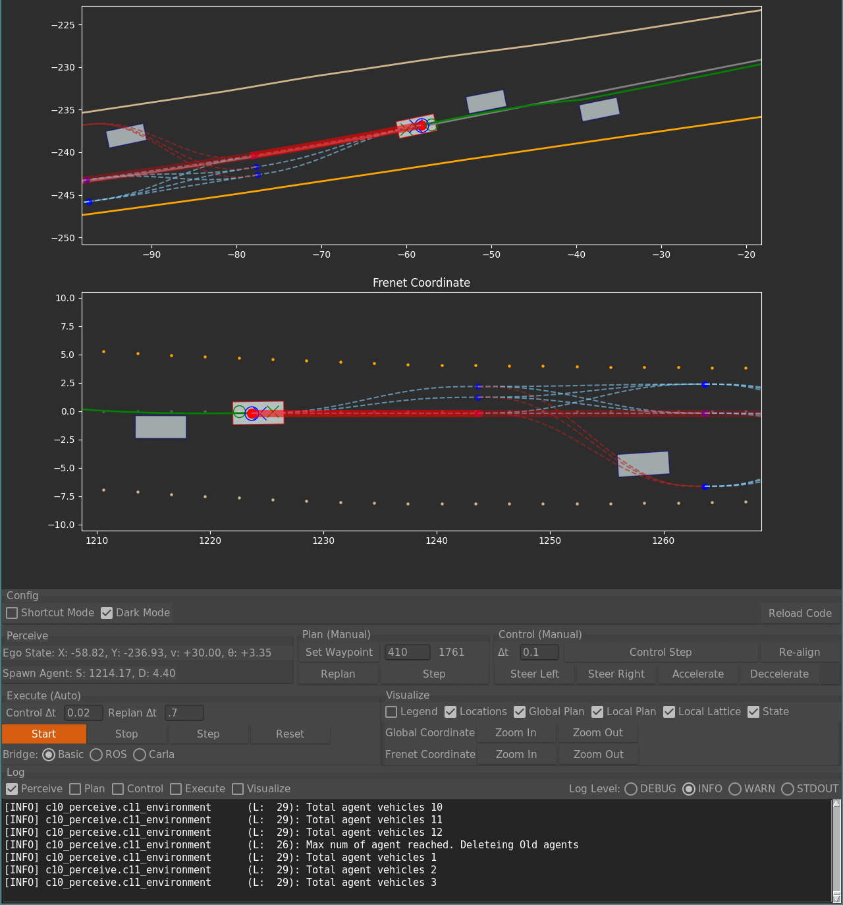

# Race Planner and Controller

To install the package, run the following commands:
```bash
pip install -r requirements.txt
```

To run the package, run the following commands:
```bash
python race_plan_control/main.py
```


## Local Planner
- Based on RRT sampling



