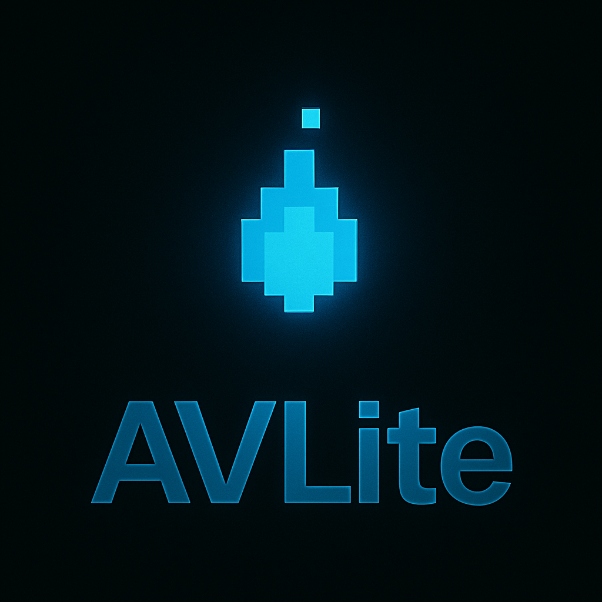
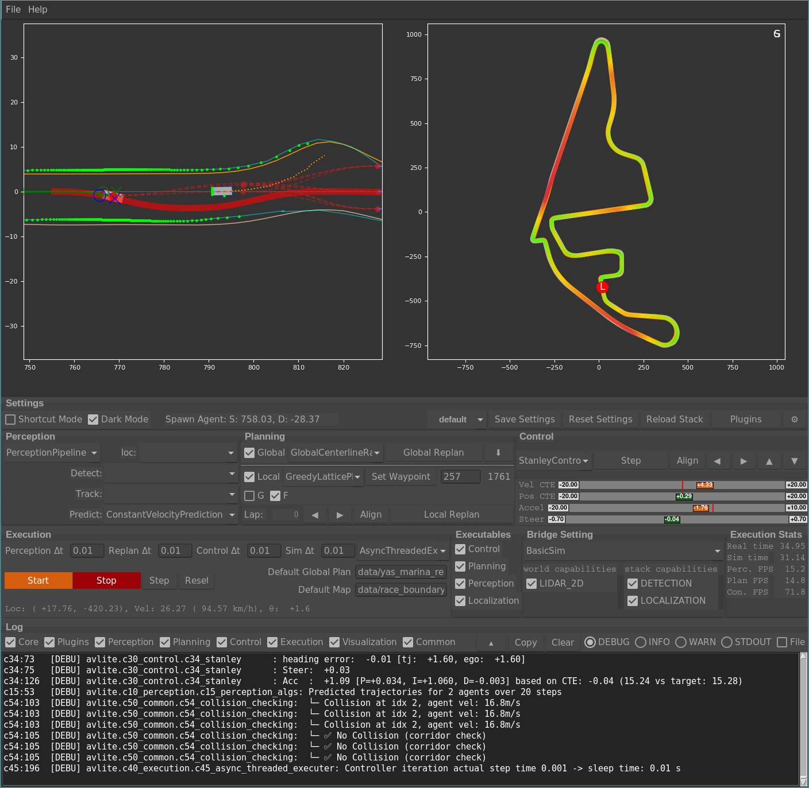
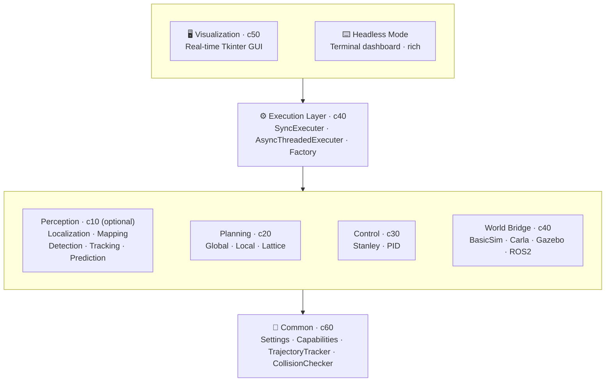

<p align="center">
  
</p>

# AVLite - Modular Autonomous Vehicle Stack

AVLite is a lightweight, extensible autonomous vehicle software stack designed for rapid prototyping, research, and education. It provides clean abstractions for perception, planning, and control while maintaining flexibility through a plugin-based architecture.

**ROS2 & Autoware Ready**: Optional ROS2 executer plugin (`avlite-executer-ROS2` in `related-repos/`) with native Autoware message support (Trajectory, ControlCommand, etc.).



## Architecture Overview

AVLite follows a modular architecture with clear separation of concerns:


```mermaid
flowchart TB
    subgraph ENTRY[" "]
        direction LR
        VIZ["🖥️ Visualization · c50\nReal-time Tkinter GUI"]
        HL["⌨️ Headless Mode\nTerminal dashboard · rich"]
        VIZ ~~~ HL
    end

    EXEC["⚙️ Execution Layer · c40\nSyncExecuter · AsyncThreadedExecuter · Factory"]

    subgraph COMPONENTS[" "]
        direction LR
        PERC["Perception · c10 (optional)\nLocalization · Mapping\nDetection · Tracking · Prediction"]
        PLAN["Planning · c20\nGlobal · Local · Lattice"]
        CTRL["Control · c30\nStanley · PID"]
        WB["World Bridge · c40\nBasicSim · Carla · Gazebo · ROS2"]
        PERC ~~~ PLAN ~~~ CTRL ~~~ WB
    end

    COMMON["🔧 Common · c60\nSettings · Capabilities · TrajectoryTracker · CollisionChecker"]

    ENTRY --> EXEC
    EXEC --> COMPONENTS
    COMPONENTS --> COMMON
```

### Core Components

- **c10_perception**: Interfaces and built-in algorithms for detection (`FastBEVLidarDetection`), tracking (`KalmanTracker`), prediction, and localization (`LidarLocalization`); `Map` / `RaceMap` in c11; OpenDRIVE `HDMap` parser in c18
- **c20_planning**: Global planning (`GlobalCenterlineRacePlanner`, `HDMapGlobalPlanner`) and local planning (`VelocityLocalPlanner`, lattice-based `GreedyLatticePlanner`)
- **c30_control**: Vehicle control algorithms (Stanley, PID)
- **c40_execution**: Execution orchestration with sync/async modes, simulator bridges, and `replan_global()`
- **c50_apps**: App infrastructure (`c51_app_strategy`, `c52_factory`, `c53_plugins`, `c54_settings_schema`, `c55_setting_utils`, `c58_paths`); no tkinter
- **c60_common**: Algorithm utilities only (`c61`–`c65`: capabilities, sensor data, trajectory, collision, FPS)
- **plugins** (`avlite/plugins/`): Built-in Tk visualizer package (`p50_visualizer_tk`), headless mode, config CLI; bridges and ROS executer live in `related-repos/`

### Key Features

**Strategy Pattern Architecture**: All major components (perception, localization, planning, control) use the strategy pattern with automatic registration, allowing runtime selection and hot-reloading without code changes.

**Capability-Based System**: Components declare their requirements and capabilities, enabling automatic compatibility checking between perception/localization strategies and world bridges.

**Optional Perception & Localization**: Both perception and localization are optional in the execution pipeline. Run with ground truth data or plug in your own strategies as needed.

**YAML-Based Configuration**: Profile-based configuration system allows quick switching between different algorithm combinations and parameters.

**Hot Reloading**: Modify code and configuration files while the system is running without restarting.

**Multiple Simulator Support**: Works with BasicSim (built-in), CARLA, Gazebo, and ROS2/Autoware through abstract world bridge interface.

**Extensible Plugin System**: Add custom perception, planning, or control algorithms as plugins without modifying core code.

## Why AVLite?

- **Lightweight**: Small codebase focused on clarity over production complexity
- **No middleware lock-in**: Works standalone; ROS2/Autoware integration is optional via `avlite-executer-ROS2`
- **Multi-simulator**: Same code runs on BasicSim, Carla, or Gazebo
- **Rapid iteration**: Hot-reload code and tune parameters without restarting
- **Minimal dependencies**: Core needs only NumPy, Matplotlib, Tkinter
- **Educational**: Numbered modules and clean abstractions for learning

## Installation

**Minimal** (core functionality):
```bash
pip install -r requirements-minimal.txt
```

**Full** (dev tools, docs):
```bash
pip install -r requirements-full.txt
```

**Optional integrations** (install separately as needed):
- **CARLA**: [CARLA releases](https://github.com/carla-simulator/carla/releases) + `avlite-bridge-carla` plugin
- **Gazebo**: ROS 2 + `avlite-bridge-gazebo` plugin
- **ROS2 + Autoware**: ROS 2 (Humble+) and optionally `autoware_auto_msgs`; clone `avlite-executer-ROS2` and/or `avlite-bridge-ROS2` from `related-repos/` (see [Optional plugins](docs/optional-plugins.md))
- **Joystick**: `avlite-controller-joystick` plugin (`pip install -r related-repos/avlite-controller-joystick/requirements.txt`)

Run from source:
```bash
python -m avlite
```

Install system-wide:
```bash
pip install .
```

## Quick Start

1. Launch the visualizer: `python -m avlite`
2. Select a profile from the Config tab (e.g., "default")
3. Click "Start/Stop Stack" to begin execution
4. Right-click on the plot to spawn NPC vehicles
5. Adjust parameters in real-time through the GUI

## Headless Mode

For long-running deployments (robots, servers, CI) AVLite ships a minimal
terminal dashboard that runs the executer without a GUI.

```bash
# Run with the 'default' profile
python -m avlite headless

# Pick a profile (saved from the visualizer)
python -m avlite headless -p my_robot_profile
python -m avlite headless my_robot_profile          # positional shortcut

# Useful options
python -m avlite headless -p my_robot_profile \
    --log-level WARNING \
    --control-dt 0.01 --replan-dt 0.5 --perceive
```

The dashboard shows live FPS, ego state, lap counter, and recent log lines.
Press **Ctrl+C** to stop.

Requires the optional [`rich`](https://github.com/Textualize/rich) package:

```bash
pip install rich
```

### Recommended workflow

1. **Configure** with the visualizer (`python -m avlite`): pick the bridge,
   strategies, and tune parameters until it behaves the way you want.
2. **Save** the result as a named profile from the Config tab.
3. **Transfer** (optional): export the profile as a zip from the settings window
   (`T`) or with `python -m avlite config-cli export-profile <name>`, then import
   on the target machine with **Import profile** or `config import-profile`.
4. **Deploy** that profile on your robot/server with
   `python -m avlite headless -p <profile>`.

The same YAML profiles drive both the GUI and headless mode, so what you
see in the visualizer is what the robot will run.

## Configuration files

Profiles are split across layer YAML files (`c10_perception.yaml`, …). Shipped defaults are in the repository `configs/` directory. Saving from the GUI or settings window writes to `~/.config/avlite/` with the same filenames; load prefers the user copy when present. User maps and trajectories live under `~/.config/avlite/data/`; the Planning panel **Save Global Plan** button (⬇) opens a file picker there. Set `AVLITE_CONFIG_DIR` or `AVLITE_DATA_DIR` to use different directories.

```bash
python -m avlite config              # settings GUI (no visualizer)
python -m avlite config-cli help
python -m avlite config-cli validate --profile default
python -m avlite config-cli export-profile myprofile -o myprofile.zip
python -m avlite config-cli import-profile myprofile.zip --force
```

See [Configuration](docs/index.md#configuration) in the docs for paths, CLI, and resetting to repo defaults.

## Community Plugins

AVLite has a community plugin system that lets anyone publish perception,
planning, control, executer, or world-bridge strategies as a small Git
repository. Community and member plugins are third-party or unverified code;
AV-Lab does not guarantee their safety. Use for research and development at
your own risk.

**Browse and install** from the GUI:

```bash
python -m avlite plugins
```

The browser has **Community** (public registry) and **Members** (AV-Lab private
registry) tabs. It fetches the official community registry
(<https://github.com/AV-Lab/avlite-community-plugins>) and lets you
install, uninstall, and register plugins with the active profile.
Installed plugins live under `$XDG_DATA_HOME/avlite/plugins`
(or `~/.local/share/avlite/plugins`); override with `AVLITE_PLUGINS_DIR`.

**Member plugins** (Members tab): sign in with GitHub (Device Flow) to browse
plugins from [avlite-private-plugins](https://github.com/AV-Lab/avlite-private-plugins).
Your account must have access to that registry and each listed plugin repo.
OAuth token is stored at `~/.config/avlite/github_oauth.json`. Distribution
builds set `AVLITE_GITHUB_OAUTH_CLIENT_ID`. See
[docs/index.md — Member plugins](docs/index.md#member-plugins) for SSO and
OAuth troubleshooting.

**Publish your own plugin**:

See the [Plugin Development Guide — Publish via pull request](docs/plugin-development.md#10-publish-to-the-community-registry-pull-request) for prerequisites, registry fields, and a PR checklist. Summary:

1. Build a plugin following the [Plugin Development Guide](docs/plugin-development.md).
2. Push it to a public Git repository.
3. Fork <https://github.com/AV-Lab/avlite-community-plugins>, add an entry
   to `plugins.yaml`:

   ```yaml
   plugins:
     - name: my_perception_plugin
       description: One-line summary of what the plugin does
       repository: https://github.com/your-org/your-plugin-repo
       version: latest        # or a tag/commit SHA
       author: your-org
       category:
         - PerceptionStrategy
   ```

4. Open a pull request. Once merged it shows up in every user's
   `python -m avlite plugins` browser for install and register.

## Project Structure

AVLite uses a numbered module system for easy navigation:

```
avlite/
├── c10_perception/         # Perception components (8 modules)
│   ├── c11_perception_model.py   # PerceptionModel, Map, RaceMap
│   ├── c12_perception_strategy.py
│   ├── c13_localization_strategy.py
│   ├── c14_mapping_strategy.py
│   ├── c15_perception_algs.py    # FastBEVLidarDetection, KalmanTracker, ConstantVelocityPrediction
│   ├── c16_localization_algs.py  # LidarLocalization (ICP)
│   ├── c18_hdmap_parser.py       # HDMap (OpenDRIVE parsing)
│   └── c19_settings.py
├── c20_planning/           # Planning components
│   ├── c21_planning_model.py
│   ├── c22_global_planning_strategy.py
│   ├── c23_local_planning_strategy.py
│   ├── c24_global_hdmap_planners.py  # HDMapGlobalPlanner
│   ├── c25_global_race_planners.py   # GlobalCenterlineRacePlanner
│   ├── c26_local_planners.py
│   ├── c27_local_lattice_planners.py
│   ├── c28_lattice.py
│   └── c29_settings.py
├── c30_control/            # Control components
│   ├── c31_control_model.py
│   ├── c32_control_strategy.py
│   ├── c33_pid.py
│   ├── c34_stanley.py
│   └── c39_settings.py
├── c40_execution/          # Execution and simulation
│   ├── c41_world_bridge.py
│   ├── c42_executer.py
│   ├── c44_sync_executer.py
│   ├── c45_async_threaded_executer.py
│   ├── c46_basic_sim.py
│   └── c49_settings.py
├── c50_apps/               # App infrastructure (no tkinter)
│   ├── c51_app_strategy.py       # AppStrategy registry + bootstrap
│   ├── c52_factory.py            # executor_factory, load_stack_settings
│   ├── c53_plugins.py            # Plugin discovery, loading, log routing
│   ├── c54_settings_schema.py    # SettingsSchema, validation
│   ├── c55_setting_utils.py      # YAML profile load/save/export
│   └── c58_paths.py              # ConfigPaths, PluginPaths, DataPaths
├── c60_common/             # Algorithm utilities (c61–c65)
│   ├── c61_capabilities.py
│   ├── c62_sensor_data.py
│   ├── c63_trajectory_tracker.py
│   ├── c64_collision_checking.py
│   └── c65_fps_tracker.py
└── plugins/               # Built-in plugins
    ├── p50_visualizer_tk/        # Tk visualizer + config + plugins apps (p51–p59)
    ├── p50_config_cli/
    └── p50_headless_mode/

related-repos/             # Optional plugins (see related-repos/README.md)
    ├── avlite-bridge-carla/
    ├── avlite-bridge-gazebo/
    ├── avlite-bridge-ROS2/
    ├── avlite-controller-joystick/
    └── avlite-executer-ROS2/
```

The numbering scheme allows quick navigation: search for "c23" to find local planning, "c34" for Stanley controller, etc.

### Optional plugins (`related-repos/`)

| Plugin | Repository folder | Role |
|--------|-------------------|------|
| `avlite-bridge-carla` | `related-repos/avlite-bridge-carla/` | CARLA world bridge |
| `avlite-bridge-gazebo` | `related-repos/avlite-bridge-gazebo/` | Gazebo Ignition bridge |
| `avlite-bridge-ROS2` | `related-repos/avlite-bridge-ROS2/` | External ROS world bridge |
| `avlite-controller-joystick` | `related-repos/avlite-controller-joystick/` | Gamepad controller |
| `avlite-executer-ROS2` | `related-repos/avlite-executer-ROS2/` | Multiprocess ROS executer |

Register in `c50_community_plugins` in `configs/c59_apps.yaml` (shipped profiles already include repo-relative paths). Settings files use dashed names, e.g. `plugin_avlite-bridge-carla.yaml`.

## Testing

Install dev dependencies and run the default fast suite (excludes slow and data-dependent tests):

```bash
pip install -e ".[dev]"
pytest
```

Run the full suite including slow timing tests and repo `data/` regressions:

```bash
pytest -m ""
```

Run with coverage (advisory, no threshold enforced):

```bash
pytest --cov=avlite --cov-report=term-missing
```

Tests mirror the package layout under `test/`. Synthetic fixtures live in `test/fixtures/` so CI does not depend on large map assets. Markers: `slow` for timing-sensitive tests, `requires_data` for Yas Marina and similar repo data checks.

## Developing Custom Plugins

See the [Plugin Development Guide](docs/plugin-development.md) for detailed instructions on creating custom perception, planning, and control components.


