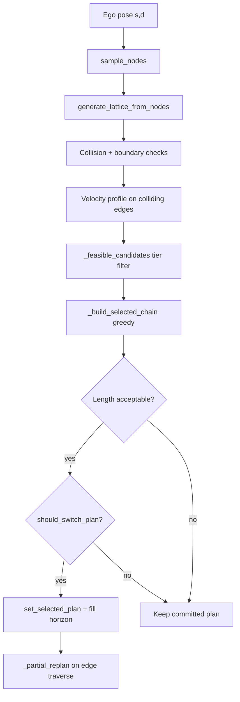

# Algorithms

This page describes the built-in **planning** algorithms in AVLite: how they fit together, how the greedy lattice local planner works, and which YAML parameters control behavior.

Configuration lives in [`configs/c20_planning.yaml`](../configs/c20_planning.yaml) and is validated by [`PlanningSettings`](../avlite/c20_planning/c29_settings.py). See [Settings naming](settings-naming.md) for key prefixes and GUI tooltips.

## Planning in the stack

Planning runs after perception (optional) and before control:

```
Global planner  →  Local planner  →  Controller
     ↓                    ↓
 GlobalPlan          LocalPlan (trajectory)
```

The **global planner** produces a reference route with lane boundaries and a velocity profile. The **local planner** reacts to nearby agents each replan cycle and outputs a short-horizon trajectory the controller tracks.

| Role | Class | Module |
|------|-------|--------|
| Global (race track) | `GlobalCenterlineRacePlanner` | [`c25_global_race_planners.py`](../avlite/c20_planning/c25_global_race_planners.py) |
| Global (HD map) | `HDMapGlobalPlanner` | [`c24_global_hdmap_planners.py`](../avlite/c20_planning/c24_global_hdmap_planners.py) |
| Local (lattice) | `GreedyLatticePlanner` | [`c27_local_lattice_planners.py`](../avlite/c20_planning/c27_local_lattice_planners.py) |
| Local (velocity only) | `VelocityLocalPlanner` | [`c26_local_planners.py`](../avlite/c20_planning/c26_local_planners.py) |

Select the local planner in the GUI or profile (`local_planner_strategy_name` in execution config). **`GreedyLatticePlanner`** is the default reactive planner for obstacle avoidance and overtaking.

---

## Global planning

### Race centerline (`GlobalCenterlineRacePlanner`)

Used on closed race tracks with left/right boundary polylines.

- Extracts a centerline between boundaries.
- Assigns a curvature-based velocity profile along the path.
- Outputs a `GlobalPlan` with `left_boundary_d`, `right_boundary_d`, and a `TrajectoryTracker` reference — all consumed by the lattice.

### HD map (`HDMapGlobalPlanner`)

Used with OpenDRIVE maps: `HDMap` in [`c11_perception_model.py`](../avlite/c10_perception/c11_perception_model.py), parsed by [`c18_hdmap_parser.py`](../avlite/c10_perception/c18_hdmap_parser.py).

- Routes on the lane graph from start to goal.
- Produces the same `GlobalPlan` structure (path, boundaries, velocity) for downstream local planning.

---

## Velocity local planner

`VelocityLocalPlanner` follows the **global path geometry** and adjusts **speed** when obstacles block the way.

- **`replan`** clones the global trajectory window and calls `profile_trajectory` to apply speed limits.
- **`apply_speed_match`** decelerates toward an agent’s speed at a collision waypoint — used when an edge is marked colliding.

When paired with the lattice planner, velocity profiling runs on colliding edges **before** edge selection so the planner can compare deceleration profiles. It can also be selected as the sole local planner for simpler follow-the-leader behavior without lateral sampling.

---

## Greedy lattice planner

`GreedyLatticePlanner` extends `LatticePlanningStrategy`. It builds a **Frenet lattice** along the global reference, evaluates candidate maneuvers, commits to a **chain of edges**, and extends that chain as the ego moves.

Implementation is split across:

- [`c27_local_lattice_planners.py`](../avlite/c20_planning/c27_local_lattice_planners.py) — selection, commitment, replan logic
- [`c28_lattice.py`](../avlite/c20_planning/c28_lattice.py) — node sampling, edge generation, boundary checks

### Coordinate frame

Planning uses Frenet coordinates relative to the global trajectory:

- **`s`** — arc length along the reference
- **`d`** — lateral offset (positive = left of reference)

Each **node** is a `(s, d)` sample. Each **edge** connects two nodes and is shaped as a quintic polynomial in `(s, d)`, converted to a `TrajectoryTracker` with position and velocity.

### Output: edge chain

The planner does not expose a single edge. It commits to a linked list:

```
selected_local_plan → selected_next_local_plan → … → None
```

`set_selected_plan` concatenates all edge trajectories into `_committed_trajectory`, which `get_local_plan()` returns to the controller. Waypoint sync advances along this single polyline.

### Replan pipeline

Each full `replan` cycle:



1. **Sample nodes** at longitudinal stations spaced by `c27_maneuver_distance`.
2. **Generate edges** between consecutive levels (fully connected graph).
3. **Check** each edge for collision and boundary violation; profile velocity on colliding edges.
4. **Filter** to feasible candidates (tiered — see below).
5. **Build chain** greedily from level-0 edges forward.
6. **Accept / switch** only if length rules and `should_switch_plan` allow it.
7. **Fill horizon** via `_partial_replan` until the chain has `c27_planning_horizon` edges.

When the ego finishes traversing an edge, `_on_edge_traversed` calls `_partial_replan` to append one new edge at the tail (sliding window).

### Lattice construction

From [`Lattice.sample_nodes`](avlite/c20_planning/c28_lattice.py):

| Level | Content |
|-------|---------|
| 0 | Ego start node at current `(s, d)` |
| 1 … `planning_horizon` | One node on the reference line (`d` from global path) plus `sample_size − 1` random lateral nodes |

Lateral nodes are sampled uniformly between lane boundaries minus `c27_boundary_clearance`.

[`generate_lattice_from_nodes`](avlite/c20_planning/c28_lattice.py) connects **every** node at level `l` to **every** node at level `l + 1`, producing a dense candidate set. Level-0 outgoing edges are stored in `lattice.level0_edges`.

**Obstacle prediction** for collision checking spans the full lattice horizon:

\[
T_{\text{pred}} = \frac{\text{planning\_horizon} \times \text{maneuver\_distance}}{v_{\text{ego}}}
\]

Moving agents get swept polygons over that horizon; static agents use inflated footprints.

### Edge feasibility

Each edge is evaluated on three axes:

| Check | Meaning | Where stored / computed |
|-------|---------|-------------------------|
| **Collision** | Ego footprint intersects an agent polygon along the edge | `edge.collision`, `edge.collision_idx`, `edge.collision_agent_velocity` |
| **Boundary** | Any path point exits `[right_boundary + clearance, left_boundary − clearance]` | `edge.boundary_violation` |
| **Curvature** | `max_curvature(edge) ≤ a_lat / v²` with ego speed (floored at `c27_min_curvature_velocity`) | `_is_curvature_feasible()` at selection time |

Curvature uses the bicycle-model relation \(a_{\text{lat}} = v^2 \kappa\), with `c27_max_lateral_accel` as the limit.

### Candidate filtering tiers

[`_feasible_candidates`](avlite/c20_planning/c27_local_lattice_planners.py) applies strict filters first, then relaxes if nothing remains:

1. **Strict** — no collision, no boundary violation, curvature feasible.
2. **Curvature fallback** (if `c27_allow_curvature_fallback`) — collision-free and in bounds; curvature ignored.
3. **Boundary fallback** (if agent blocks ahead **or** `c27_allow_boundary_violation_fallback`) — collision-free only.

**Agent blocks ahead** is true when any agent is in front of the ego (by heading dot product) within the planning horizon in `s`.

When an agent blocks ahead, chain building **prefers lateral successors** with `|end.d| ≥ c27_d0_reference_threshold` so the planner keeps offset paths through an overtake instead of merging back to center too early.

### Edge selection cost

[`_select_best_edge`](avlite/c20_planning/c27_local_lattice_planners.py) picks the minimum-cost candidate:

- **Hard preference** for edges ending near the reference (`|end.d| < c27_d0_reference_threshold`) when any exist.
- **Cost** = `|end.d| + c27_safety_margin_weight × clearance_penalty` (lower clearance → higher cost).

### Plan commitment and switching

The planner avoids swapping plans every replan tick so the controller can converge on a stable reference.

**Length acceptance** (in `replan`) — a new chain is considered only if:

- No current plan and new chain has ≥ 1 edge, or
- New chain is **longer or equal**, or
- Length differs by at most **1** edge, or
- Current chain has a collision and the new chain is **clean**

**`should_switch_plan`** — even if acceptable, switching requires:

| Immediate switch | Discretionary switch |
|------------------|----------------------|
| No committed plan | Longer clean chain, or escape from colliding chain |
| Emergency-stop recovery to clean plan | Requires **wait time** (`c27_replan_wait_time`) **or** chain **+2 edges** |
| Current edge done, no successor | Same-length speed upgrade (+0.5 m/s) only after **wait time** |
| Urgent collision (within `c27_urgent_collision_threshold` waypoints) | |
| Geometric disconnect (`> c27_disconnect_distance_threshold` m from plan) | |
| Head edge colliding, agent cleared (+0.5 m/s faster clean plan) | |

A clean committed chain is **not** replaced for a slightly faster resampled plan on every replan cycle. Immediate +0.5 m/s applies only when recovering from a **colliding head edge** (obstacle just cleared). Emergency passing commits also go through `should_switch_plan`.

Same-length clean alternatives with similar speed never switch (anti-jitter).

On switch, a **velocity ramp** over the first `c27_match_speed_wp_buffer` waypoints blends from ego speed into the plan when recovering from a stop.

### Emergency behavior

If no strictly feasible level-0 edges exist:

1. Retry with boundary relaxed (`agent_blocks_ahead=True` filtering) — commit only if `should_switch_plan` allows.
2. If still blocked, pick the edge with the **latest** collision index (most reaction time) only when `should_switch_plan` allows; otherwise keep the current committed chain.
3. If no edges are generated at all, decelerate the current committed trajectory to zero.

### Debug visualization

Enable the local lattice plot in the stack view. Edge colors in [`p69_plot_lib.py`](../avlite/plugins/p60_visualizer_tk/p69_plot_lib.py):

| Color | Meaning |
|-------|---------|
| Green (`#8ec07c`) | Feasible — no collision, in bounds, curvature OK |
| Blue | Kinematic violation — boundary and/or curvature |
| Red | Collision |

The plot draws **all** lattice edges, not only the committed chain. During overtake, **blue** edges may still be selected when boundary constraints are relaxed, so many blue lines are normal in dense traffic.

---

## Parameter reference

Defaults match [`PlanningSettings`](../avlite/c20_planning/c29_settings.py). Adjust per profile in `c20_planning.yaml`.

### Lattice geometry and sampling

| Key | Default | Description |
|-----|---------|-------------|
| `c27_planning_horizon` | `3` | Number of edges in the committed chain (maneuver segments) |
| `c27_maneuver_distance` | `30` | Longitudinal spacing between lattice levels (m) |
| `c27_sample_size` | `3` | Lateral samples per level (1 on reference + `sample_size − 1` random) |
| `c27_num_of_edge_points` | `10` | Waypoints along each quintic edge |
| `c27_boundary_clearance` | `0.5` | Inset from lane boundaries for sampling and violation checks (m) |
| `c27_d0_reference_threshold` | `0.2` | Treat `\|d\|` below this as “on reference” for selection and lateral preference (m) |

### Feasibility and fallbacks

| Key | Default | Description |
|-----|---------|-------------|
| `c27_max_lateral_accel` | `4.0` | Lateral acceleration limit for curvature feasibility (m/s²) |
| `c27_min_curvature_velocity` | `3.0` | Speed floor used when evaluating curvature at low ego speed (m/s) |
| `c27_allow_curvature_fallback` | `false` | If strict tier is empty, allow edges that fail curvature but stay in bounds |
| `c27_allow_boundary_violation_fallback` | `false` | If still empty, allow collision-free edges outside bounds |

Boundary relaxation also applies automatically when an agent blocks ahead (overtake path).

### Replan stability

| Key | Default | Description |
|-----|---------|-------------|
| `c27_replan_wait_time` | `2.5` | Minimum time between discretionary plan switches (s) |
| `c27_urgent_collision_threshold` | `3` | Waypoints to collision before immediate switch |
| `c27_disconnect_distance_threshold` | `5.0` | Max distance from plan waypoint before forced switch (m) |
| `c27_min_edge_progress_to_block` | `0.2` | Min fraction of edge progress before replan blocking (reserved) |

### Selection and velocity continuity

| Key | Default | Description |
|-----|---------|-------------|
| `c27_safety_margin_weight` | `0.3` | Weight of clearance in edge cost |
| `c27_match_speed_wp_buffer` | `4` | Waypoints for velocity ramp after plan switch |
| `c27_min_ramp_start_velocity` | `3.0` | Minimum creep speed when ramping after recovery (m/s) |

### Shared collision settings (`c20_*`)

Used by lattice, velocity planner, and global boundary inset.

| Key | Default | Description |
|-----|---------|-------------|
| `c20_collision_safety_margin` | `0.3` | Extra inflation on ego footprint in collision checks (m) |
| `c20_obstacle_inflation_margin` | `0.5` | Inflation on agent polygons for lattice prediction (m) |
| `c20_default_ego_velocity` | `5.0` | Assumed ego speed when velocity is unknown (m/s) |
| `c20_min_velocity_threshold` | `0.5` | Speed below which ego/agents treated as stopped (m/s) |
| `c20_boundary_margin` | `0.0` | Global plan boundary inset from track or HD map edges (m) |

### Velocity planner (`c26_*`)

Used by `VelocityLocalPlanner` and for speed-matching on colliding lattice edges.

| Key | Default | Description |
|-----|---------|-------------|
| `c26_stopping_decel_factor` | `0.8` | Fraction of max decel used when stopping behind an agent |
| `c26_fallback_deceleration` | `3.0` | Deceleration when max decel is unavailable (m/s²) |
| `c26_stopping_safety_buffer` | `2.0` | Extra standoff distance when stopping (m) |
| `c26_follow_gap_buffer` | `0.5` | Bumper-to-bumper gap beyond vehicle lengths (m) |
| `c26_follow_cruise_min_gap` | `15.0` | Gap before deferring back to global cruise speed (m) |
| `c26_planning_horizon_points` | `50` | Waypoint window for velocity local plan from current index |

!!! tip "Tuning notes"
    - **Many blue edges at high speed** — curvature limit tightens as \(v^2\); raise `c27_max_lateral_accel` or enable `c27_allow_curvature_fallback`.
    - **Overtake not lateral enough** — check agent detection horizon; boundary relax only triggers when `_agent_blocks_ahead` is true.
    - **Plan jitter / controller never settles** — increase `c27_replan_wait_time`; discretionary switches need wait or material gain (+2 edges or +0.5 m/s).
    - **Too conservative following** — reduce `c26_follow_cruise_min_gap` or collision margins (`c20_*`).

---

## Related reading

- [Architecture](architecture.md) — stack layers and data flow
- [Settings naming](settings-naming.md) — YAML key prefixes and validation
