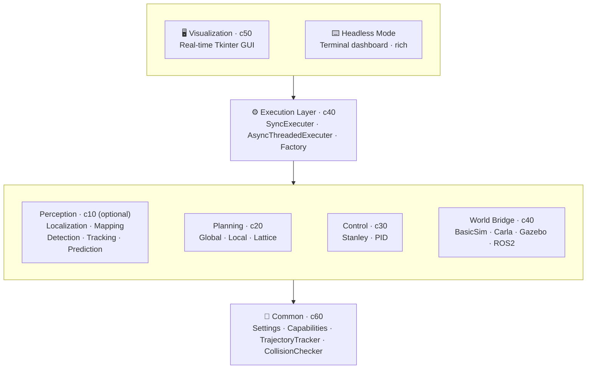

# Architecture

## Overview

AVLite follows a layered architecture with clear separation between interfaces and implementations.



## Design Patterns

### Strategy Pattern with Auto-Registration

All major components use abstract base classes with automatic registration:

```python
class PerceptionStrategy(ABC):
    registry = {}
    
    def __init_subclass__(cls, abstract=False, **kwargs):
        super().__init_subclass__(**kwargs)
        if not abstract:
            PerceptionStrategy.registry[cls.__name__] = cls
```

When you create a subclass, it automatically registers itself and appears in the UI dropdowns. No manual registration needed.

### Capability System

Components declare what they require and provide:

```python
class MyPerception(PerceptionStrategy):
    @property
    def requirements(self) -> set[WorldCapability]:
        # What I need from the world/simulator
        return {WorldCapability.CAMERA_RGB}
    
    @property
    def capabilities(self) -> set[PerceptionCapability]:
        # What I provide
        return {PerceptionCapability.DETECTION}
```

**World Capabilities** (what simulators can provide):

- `GT_DETECTION` - Ground truth object detection
- `GT_TRACKING` - Ground truth tracking IDs
- `GT_LOCALIZATION` - Ground truth ego pose
- `CAMERA_RGB` - RGB camera images
- `CAMERA_DEPTH` - Depth camera images
- `LIDAR_3D` - 3D LiDAR point cloud data
- `LIDAR_2D` - 2D LiDAR scanner data
- `RADAR` - Radar sensor data
- `WHEEL_ENCODER` - Wheel encoder for odometry
- `IMU` - Inertial measurement unit
- `GNSS` - GNSS / GPS receiver

**Perception Capabilities** (what perception strategies provide):

- `DETECTION` - Object detection
- `TRACKING` - Object tracking
- `PREDICTION` - Motion prediction

**Localization Capabilities** (what localization strategies provide):

- `LOCALIZATION_2D` - 2D pose estimation (x, y)
- `LOCALIZATION_3D` - 3D pose estimation (x, y, z)
- `LOCALIZATION_HEADING` - Heading / yaw estimation
- `LOCALIZATION_HEADING_3D` - Full 3D orientation (roll, pitch, yaw)
- `VELOCITY` - Velocity estimation

**Mapping Capabilities** (what mapping strategies provide):

- `OCCUPANCY_GRID` - Occupancy grid mapping
- `PATH_BOUNDARY` - Path boundary extraction
- `OPENDRIVE_HDMAP` - OpenDRIVE HD map integration

### Factory Pattern

The executor factory assembles components based on configuration:

```python
executer = executor_factory(
    bridge="BasicSim",
    perception_strategy_name="MultiObjectPredictor",
    localization_strategy_name="MyLocalization",
    local_planner_strategy_name="GreedyLatticePlanner",
    controller_strategy_name="StanleyController"
)
```

It loads extensions, instantiates strategies from registries, and wires everything together. Both `perception_strategy_name` and `localization_strategy_name` are optional — pass an empty string or omit them to run without that component.

## Core Modules

### c10_perception

Provides **interfaces** for:
- `PerceptionStrategy` (optional) - Monolithic detect/track/predict interface; subclasses auto-register and appear in the UI dropdown
- `DetectionStrategy` - Detection-only sub-strategy with its own registry; used by `PerceptionPipeline`
- `TrackingStrategy` - Tracking-only sub-strategy with its own registry; used by `PerceptionPipeline`
- `PredictionStrategy` - Prediction-only sub-strategy with its own registry; used by `PerceptionPipeline`
- `PerceptionPipeline` - Built-in `PerceptionStrategy` that composes a `DetectionStrategy`, `TrackingStrategy`, and `PredictionStrategy` selected by name; missing stages fall back to ground truth from the bridge
- `LocalizationStrategy` (optional) - Ego-vehicle pose estimation. Updates `PerceptionModel.ego_vehicle` in-place.
- `MappingStrategy` - Environment mapping
- `HDMap` - OpenDRIVE map parsing and routing

Both `PerceptionStrategy` and `LocalizationStrategy` are optional in the execution pipeline. Implementations come from extensions/plugins.

### c20_planning

- `GlobalPlannerStrategy` - Route planning interface
- `LocalPlanningStrategy` - Reactive planning interface
- `Lattice` - Frenet frame lattice for local planning
- `Trajectory` - Path + velocity profile

Built-in planners:
- `GlobalCenterlineRacePlanner` (`c25_global_race_planners.py`) - Race-line planner from a JSON left/right boundary file; curvature-adapted target velocities
- `HDMapGlobalPlanner` (`c24_global_hdmap_planners.py`) - OpenDRIVE HD map A\* route planner
- `GreedyLatticePlanner` - Greedy lattice-based local planner with collision avoidance

### c30_control

- `ControlStrategy` - Vehicle control interface
- `ControlCommand` - Throttle/brake + steering output

Includes built-in controllers: `StanleyController`, `PIDController`.

### c40_execution

- `WorldBridge` (`c41_world_bridge.py`) — simulator/ROS interface and sensor getters
- `Executer` (`c42_executer.py`) — base orchestration loop and pipeline steps
- `executor_factory` (`c43_factory.py`) — component assembly
- `SyncExecuter` / `AsyncThreadedExecuter` (`c44` / `c45`) — concrete scheduling
- `ExecutionSettings` - Runtime settings including `log_level` (DEBUG/INFO/WARNING/ERROR/CRITICAL) and `log_to_file` (write logs to `./logs/avlite_<timestamp>.log`)

Built-in bridges: `BasicSim` (c46_basic_sim.py) — includes 2-D LiDAR simulation via raycasting, `CarlaBridge` (bridge_carla), `GazeboIgnitionBridge` (bridge_gazebo), `ROS2WorldBridge` (bridge_ROS2).

### c50_visualization

Tkinter-based GUI with:
- Real-time plotting (XY, Frenet views)
- Component configuration
- Profile management
- Log viewer
- Extension settings

### c60_common

- Settings load/save (YAML profiles)
- Hot reloading
- Extension discovery
- Capability enums (`WorldCapability`, `PerceptionCapability`, `LocalizationCapability`, `MappingCapability`)
- `AnyOf` — requirement satisfied by any one of several capabilities; `satisfies_requirements()` helper used by the execution layer
- `HDMap` (`c68_hdmap.py`) — OpenDRIVE map parsing and routing (used by `HDMapGlobalPlanner` and `PerceptionModel`)
- `SensorFrame` (`c67_sensor_data.py`) — canonical sensor formats between WorldBridge and perception/localization (authoritative spec for rgb, depth, lidar, imu, gnss, wheel odometry)
- `rename_setting_profile()` — rename saved YAML profiles

### Sensor data conventions

Raw sensor layouts are defined in [`avlite/c60_common/c67_sensor_data.py`](../avlite/c60_common/c67_sensor_data.py). WorldBridge implementations convert simulator/ROS messages into these formats before passing a `SensorFrame` to perception and localization. Array fields use semantic aliases `RgbImage`, `DepthImage`, and `LidarCloud` (all `np.ndarray` with layouts documented in c67). Key fields: `rgb` `(H,W,3)` uint8 RGB; `depth` `(H,W)` float32 metres; `lidar` `(N,4)` float32 `[x,y,z,intensity]` in map frame; `GnssReading` with WGS84 lat/lon/alt plus optional map-frame `map_x/y/z`.

## Data Flow

```
World Bridge → SensorFrame → Localization / Perception → PerceptionModel → Planning → Control
```

```
World Bridge
    │
    ├─► Sensor Data ──► Localization ──► Ego Pose (updated in-place)
    │                                          │
    ├─► Sensor Data ──► Perception ───► Agents │
    │                                          ▼
    │                              Local Planner
    │                                          │
    │                                          ▼
    │                              Trajectory
    │                                          │
    │                                          ▼
    │                              Controller
    │                                          │
    └─────────────── Control Command ◄─────────┘
```

1. **World Bridge** provides sensor data (IMU, LiDAR, camera, ground truth)
2. **Localization** (optional) estimates the ego pose from sensor data, updating `PerceptionModel.ego_vehicle` in-place
3. **Perception** (optional) detects/tracks/predicts surrounding agents
4. **Local Planner** generates trajectory avoiding obstacles
5. **Controller** computes steering and throttle
6. **World Bridge** executes control command

## Extension System

```
avlite/
└── extensions/           # Built-in (core team)
    ├── bridge_carla/
    ├── bridge_gazebo/
    ├── bridge_ROS2/
    ├── executer_ROS2/
    └── multi_object_prediction/

/path/to/                 # Community plugins
└── my_plugin/
    ├── __init__.py
    ├── settings.py
    └── ...
```

Extensions are loaded at startup. Classes inheriting from base strategies auto-register.

See [Plugin Development](plugin-development.md) for creating community plugins.
