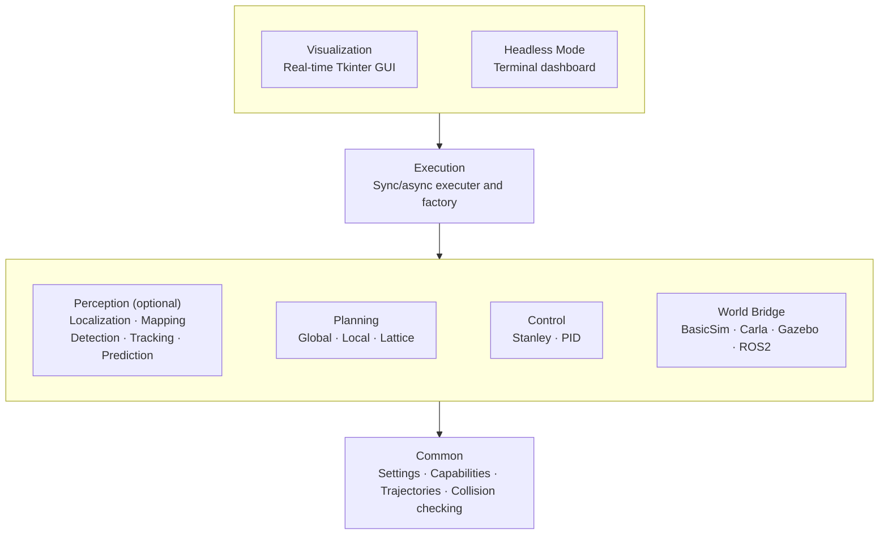

# Architecture

## Overview

AVLite follows a layered architecture with clear separation between interfaces and implementations.



## Design Patterns

### Strategy Pattern with Auto-Registration

All major components use abstract base classes with automatic registration:

```python
class PerceptionStrategy(ABC):
    registry = {}
    
    def __init_subclass__(cls, abstract=False, **kwargs):
        super().__init_subclass__(**kwargs)
        if not abstract:
            PerceptionStrategy.registry[cls.__name__] = cls
```

When you create a subclass, it automatically registers itself and appears in the UI dropdowns. No manual registration needed.

### Capability System

Components declare what they require and provide:

```python
class MyPerception(PerceptionStrategy):
    @property
    def requirements(self) -> set[WorldCapability]:
        # What I need from the world/simulator
        return {WorldCapability.CAMERA_RGB}
    
    @property
    def capabilities(self) -> set[PerceptionCapability]:
        # What I provide
        return {PerceptionCapability.DETECTION}
```

**World Capabilities** (what simulators can provide):

- `GT_DETECTION` - Ground truth object detection
- `GT_TRACKING` - Ground truth tracking IDs
- `GT_LOCALIZATION` - Ground truth ego pose
- `CAMERA_RGB` - RGB camera images
- `CAMERA_DEPTH` - Depth camera images
- `LIDAR_3D` - 3D LiDAR point cloud data
- `LIDAR_2D` - 2D LiDAR scanner data
- `RADAR` - Radar sensor data
- `WHEEL_ENCODER` - Wheel encoder for odometry
- `IMU` - Inertial measurement unit
- `GNSS` - GNSS / GPS receiver

**Perception Capabilities** (what perception strategies provide):

- `DETECTION` - Object detection
- `TRACKING` - Object tracking
- `PREDICTION` - Motion prediction

**Localization Capabilities** (what localization strategies provide):

- `LOCALIZATION_2D` - 2D pose estimation (x, y)
- `LOCALIZATION_3D` - 3D pose estimation (x, y, z)
- `LOCALIZATION_HEADING` - Heading / yaw estimation
- `LOCALIZATION_HEADING_3D` - Full 3D orientation (roll, pitch, yaw)
- `VELOCITY` - Velocity estimation

**Mapping Capabilities** (what mapping strategies provide):

- `OCCUPANCY_GRID` - Occupancy grid mapping
- `PATH_BOUNDARY` - Path boundary extraction
- `OPENDRIVE_HDMAP` - OpenDRIVE HD map integration

### Factory Pattern

The executor factory assembles components based on configuration:

```python
executer = executor_factory(
    bridge="BasicSim",
    perception_strategy_name="MultiObjectPredictor",
    localization_strategy_name="MyLocalization",
    local_planner_strategy_name="GreedyLatticePlanner",
    controller_strategy_name="StanleyController"
)
```

It loads plugins, instantiates strategies from registries, and wires everything together. Both `perception_strategy_name` and `localization_strategy_name` are optional — pass an empty string or omit them to run without that component.

## Layers

### **Perception**

Optional monolithic or pipelined detect/track/predict strategies, plus localization and mapping interfaces. Built-in algorithms and plugin implementations register automatically and appear in UI dropdowns. See [Plugin Development](plugin-development.md) for monolithic vs pipeline extension paths.

### **Planning**

Global route planning and reactive local planning (lattice-based). Produces trajectories for the controller.

### **Control**

Vehicle control strategies (Stanley, PID) output throttle/brake and steering.

### **Execution**

World bridge (simulator/ROS interface), executer orchestration loop, sync/async scheduling, and the factory that wires the stack from YAML configuration. Built-in bridges include BasicSim, CARLA, Gazebo, and ROS2 (via plugins).

### **Visualization**

Tkinter GUI: real-time plots, profile/config management, schema tooltips, thread-safe log filtering (Core / Plugins / per-layer toggles), and plugin settings.

### **Common**

YAML profile load/save, hot reload, plugin discovery, capability enums, HD map and OpenDRIVE parsing, canonical sensor layouts (rgb, depth, lidar, imu, gnss between bridge and perception), and settings validation.

## Data Flow

```
World Bridge → SensorFrame → Localization / Perception → PerceptionModel → Planning → Control
```

```
World Bridge
    │
    ├─► Sensor Data ──► Localization ──► Ego Pose (updated in-place)
    │                                          │
    ├─► Sensor Data ──► Perception ───► Agents │
    │                                          ▼
    │                              Local Planner
    │                                          │
    │                                          ▼
    │                              Trajectory
    │                                          │
    │                                          ▼
    │                              Controller
    │                                          │
    └─────────────── Control Command ◄─────────┘
```

1. **World Bridge** provides sensor data (IMU, LiDAR, camera, ground truth)
2. **Localization** (optional) estimates the ego pose from sensor data, updating `PerceptionModel.ego_vehicle` in-place
3. **Perception** (optional) detects/tracks/predicts surrounding agents
4. **Local Planner** generates trajectory avoiding obstacles
5. **Controller** computes steering and throttle
6. **World Bridge** executes control command

## Plugin System

```
avlite/
└── plugins/              # Built-in (core team)
    ├── p10_perception_MO_prediction/
    ├── p30_controller_joystick/
    ├── p40_bridge_carla/
    ├── p40_bridge_gazebo/
    ├── p40_bridge_ROS2/
    ├── p40_executer_ROS2/
    └── p50_headless_mode/

~/.local/share/avlite/plugins/   # Community (installed)
└── my_plugin/
    ├── __init__.py
    ├── settings.py
    └── ...
```

Plugins are loaded at startup. Classes inheriting from base strategies auto-register.

See [Plugin Development](plugin-development.md) for creating community plugins, pNx naming, and log filtering.
