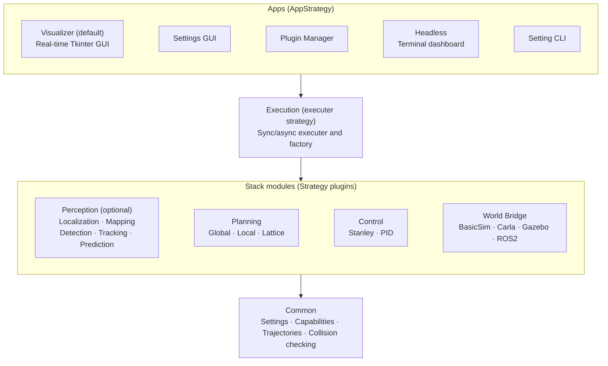
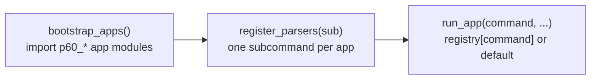

# Architecture

## Overview

AVLite follows a layered architecture with clear separation between interfaces and implementations. Every layer is extendable: apps, executers, perception/planning/control strategies, and world bridges are all auto-registered strategies, and any of them can be added or overridden by a plugin.



Every box above the Common layer is a pluggable strategy: apps register via `AppStrategy`, and the stack modules (perception, planning, control, world bridge) plus the executer itself register via their own strategy base classes. See [Strategy Pattern with Auto-Registration](#strategy-pattern-with-auto-registration).

## Design Patterns

### Strategy Pattern with Auto-Registration

All major components use abstract base classes with automatic registration:

```python
class PerceptionStrategy(ABC):
    registry = {}
    
    def __init_subclass__(cls, abstract=False, **kwargs):
        super().__init_subclass__(**kwargs)
        if not abstract:
            PerceptionStrategy.registry[cls.__name__] = cls
```

When you create a subclass, it automatically registers itself and appears in the UI dropdowns. No manual registration needed.

### App Strategy (CLI/GUI entry points)

Every entry point — the Tkinter visualizer, the settings GUI, the plugin manager, the headless runner, the setting CLI — is just an *app*: an `AppStrategy` subclass that auto-registers exactly like `PerceptionStrategy`, keyed by `cli_name` (`None` marks the default app that runs when no subcommand is given).

```python
class MyToolApp(AppStrategy):
    cli_name = "my-tool"        # None = default app
    help = "Short description for avlite --help"

    def run(self, args, unknown):
        ...
        return 0                 # optional; None = exit 0
```

The Tk visualizer and headless dashboard carry no special status — they are two of several built-in apps, and new apps drop in the same way (subclass, set `cli_name`, implement `run()`, optionally `configure_parser()` for flags). At startup [`__main__.py`](../avlite/__main__.py) drives the dispatch:



Built-in apps ship as `p60_*` plugins (`p60_visualizer_tk`, `p60_headless_mode`, `p60_setting_cli`), so the app layer is fully extendable — community plugins can register their own apps. See [Plugin Development → Apps](plugin-development.md#apps-appstrategy).

### Capability System

Components declare what they require and provide along a clean 2x2 grid keyed on capability space (world/sensor vs stack) and direction (requires vs provides):

| | requires | provides |
| --- | --- | --- |
| **World layer** (`WorldCapability`) | `world_requirements` | `world_capabilities` (world bridge only) |
| **Stack layer** (`StackCapability`) | `stack_requirements` | `stack_capabilities` |

- A **strategy** declares `world_requirements`, `stack_requirements` (non-abstract, per-module defaults), and `stack_capabilities` (what it produces).
- A **world bridge** declares `world_capabilities` (sensors it exposes) and `stack_capabilities` (ground truth it provides).

```python
class MyPerception(PerceptionStrategy):
    @property
    def world_requirements(self) -> set[WorldCapability]:
        # What I need from the world/simulator (sensors)
        return {WorldCapability.CAMERA_RGB}

    @property
    def stack_capabilities(self) -> set[StackCapability]:
        # What I provide to downstream modules
        return {StackCapability.DETECTION}
```

**World Capabilities** (sensors / actuation the bridge provides):

- `CAMERA_RGB` - RGB camera images
- `CAMERA_DEPTH` - Depth camera images
- `LIDAR_3D` - 3D LiDAR point cloud data
- `LIDAR_2D` - 2D LiDAR scanner data
- `RADAR` - Radar sensor data
- `WHEEL_ENCODER` - Wheel encoder for odometry
- `IMU` - Inertial measurement unit
- `GNSS` - GNSS / GPS receiver
- `AGENT_SPAWN` - Bridge can spawn NPC agents
- `AGENT_CONTROL` - Bridge can actuate spawned NPC agents via `control_agent` (opt-in; separate from `AGENT_SPAWN`)

**Stack Capabilities** (`StackCapability`) — what a stack module produces, used both as a module's `stack_capabilities` and as another module's `stack_requirements`:

- `DETECTION` - Object detection
- `TRACKING` - Object tracking
- `PREDICTION` - Motion prediction
- `LOCAL_PLAN` - Local plan (produced by the local planner)
- `GLOBAL_PLAN` - Global plan (produced by the global planner)
- `CONTROL` - Control commands (produced by the controller)
- `LOCALIZATION` - Ego localization
- `MAP` - Map
- `SLAM` - Simultaneous localization and mapping

**Ground truth via the world bridge:** a `WorldBridge` may advertise `stack_capabilities` (a `set[StackCapability]`, default empty) to satisfy downstream `stack_requirements` without a real module. For example, `BasicSim` provides `{DETECTION, TRACKING, LOCALIZATION}` as ground truth. The executer combines every present module's `stack_capabilities` with `world.stack_capabilities` and warns when a module's `stack_requirements` are unmet.

### Factory Pattern

The executor factory assembles components based on configuration:

```python
executer = executor_factory(
    bridge="BasicSim",
    perception_strategy_name="MultiObjectPredictor",
    localization_strategy_name="MyLocalization",
    local_planner_strategy_name="GreedyLatticePlanner",
    controller_strategy_name="StanleyController"
)
```

It loads plugins, instantiates strategies from registries, and wires everything together. Both `perception_strategy_name` and `localization_strategy_name` are optional — pass an empty string or omit them to run without that component.

Before calling `executor_factory()`, load YAML profiles with `load_stack_settings(profile, load_plugins)` in [`c62_factory.py`](../avlite/c60_apps/c62_factory.py). Each setting reads its section from the single `configs/<profile>.yaml`: it loads the c10–c40 layer sections, `AppSettings` (the `c69_apps` section), and built-in plugin settings (the `plugins` section); the GUI loads the Tk `VisualizationSettings` binder separately.

### Layer import rules

Stack core (`c10`–`c40`, `c50_common`) may import `c61_app_strategy`, `c64_settings_schema`, `c68_paths`, and `c69_settings` only. Profile export/import operates on a single per-profile YAML file (`c65_setting_utils.export_profile` / `import_profile`), with checkboxes to include the `c69_apps` and `plugins` sections. Tk binder `VisualizationSettings` lives in plugin `settings.py`; `c69_settings` is schema-only (plugin bootstrap fields use `c62_*`, consumed by `c62_factory`).

### Agent model

Agents are represented as a small class hierarchy in c11:

```
State → AgentState → EgoState
```

- **`EGO_AGENT_ID = 0`** — reserved for the ego vehicle (`perception_model.ego_vehicle`).
- **NPC ids `1, 2, 3, …`** — assigned by `PerceptionModel.add_agent_vehicle`.
- **`AgentType`** — platform metadata on each agent (Ackermann, diff-drive, aerial, pedestrian, …).
- **Default state** — pose (`x`, `y`, `z`, `theta`) plus scalar `velocity` (car-centric; used by planning, collision, and viz).
- **Future** — specialized subclasses (e.g. `DroneAgentState`) when kinematics need body velocity or 3D integration; see [Multi-robot agents and control](plugin-development.md#7-multi-robot-agents-and-control).

Control actuation is a separate layer: `ControlCommandBase` subclasses in c31, with default `AgentType` → command mapping in c38. The car stack still uses the `ControlCommand` alias for `AckermannControlCommand`.

## Layers

### **Perception**

Optional monolithic or pipelined detect/track/predict strategies, plus localization and mapping interfaces. Built-in algorithms and plugin implementations register automatically and appear in UI dropdowns. Static map types (`Map`, `RaceMap`, `HDMap`) live in c11; OpenDRIVE parsing is in c18. See [Plugin Development](plugin-development.md) for monolithic vs pipeline extension paths.

### **Planning**

Global route planning and reactive local planning (lattice-based). Produces trajectories for the controller. See [Algorithms](algorithms.md) for lattice planner details.

### **Control**

Vehicle control strategies (Stanley, PID) output actuation commands. Commands use a `ControlCommandBase` hierarchy (`AckermannControlCommand`, `DiffDriveControlCommand`, `BodyVelocityControlCommand` in c31); the built-in car stack still returns `ControlCommand` (Ackermann alias). Per-agent command type defaults are mapped from `AgentType` in c38. See [Plugin Development → Multi-robot agents and control](plugin-development.md#7-multi-robot-agents-and-control).

### **Execution**

World bridge (simulator/ROS interface), executer orchestration loop, sync/async scheduling, and the factory that wires the stack from YAML configuration. The built-in `BasicSim` bridge ships with the core stack; CARLA, Gazebo, and ROS2 are supported through optional world-bridge plugins. Alternative executers (for example a multiprocess ROS deployment) are selected via `c40_executer_type` and provided as optional plugins.

### **Apps**

CLI and GUI entry points, each an `AppStrategy` (see [App Strategy](#app-strategy-cligui-entry-points)). Built-in apps ship as `p60_*` plugins and the layer is extendable:

- **Visualizer** (default, `avlite`) — Tkinter GUI: real-time plots, profile/config management, schema tooltips, thread-safe log filtering (Core / Plugins / per-layer toggles), and plugin settings.
- **Settings GUI** (`avlite setting`) — full stack settings editor window.
- **Plugin Manager** (`avlite plugins`) — browse, install, and register community plugins.
- **Headless** (`avlite headless`) — runs the same YAML profile with a terminal dashboard, no GUI.
- **Setting CLI** (`avlite setting-cli`) — validate/describe/import/export profiles from the terminal.

### **Common**

YAML profile load/save, hot reload, plugin discovery (`c63_plugins`), path resolution (`c68_paths`), capability enums, canonical sensor layouts (rgb, depth, lidar, imu, gnss between bridge and perception), collision checking, and settings validation (`c64_settings_schema`).

## Data Flow

```
World Bridge → SensorFrame → Localization / Perception → PerceptionModel → Planning → Control
```

```
World Bridge
    │
    ├─► Sensor Data ──► Localization ──► Ego Pose (updated in-place)
    │                                          │
    ├─► Sensor Data ──► Perception ───► Agents │
    │                                          ▼
    │                              Local Planner
    │                                          │
    │                                          ▼
    │                              Trajectory
    │                                          │
    │                                          ▼
    │                              Controller
    │                                          │
    └─────────────── Control Command ◄─────────┘
                          │
              (future: control_agent for NPC fleet)
```

1. **World Bridge** provides sensor data (IMU, LiDAR, camera, ground truth)
2. **Localization** (optional) estimates the ego pose from sensor data, updating `PerceptionModel.ego_vehicle` in-place
3. **Perception** (optional) detects/tracks/predicts surrounding agents
4. **Local Planner** generates trajectory avoiding obstacles
5. **Controller** computes steering and throttle (Ackermann today; other command types reserved for multi-robot plugins)
6. **World Bridge** executes control command via `control_ego_state` (ego path unchanged; `control_agent` and `step()` hooks exist for future multi-agent and sub-stepping)

## Plugin System

```
avlite/
└── plugins/            # Built-in (core team)
    ├── p60_visualizer_tk/   # visualizer + config + plugins Tk apps
    ├── p60_setting_cli/
    └── p60_headless_mode/

~/.local/share/avlite/plugins/   # Community (installed)
└── my_plugin/
    ├── __init__.py
    ├── settings.py
    └── ...

~/.config/avlite/plugin_my_plugin.yaml   # Community plugin settings (user config, not in install dir)
```

Plugins are loaded at startup. Classes inheriting from base strategies auto-register. The built-in `p60_*` packages are the apps themselves (`AppStrategy` entry points); `bootstrap_apps()` in `c61_app_strategy` imports them at startup so their apps register before CLI parsing.

See [Plugin Development](plugin-development.md) for creating community plugins, pNx naming, and log filtering.
