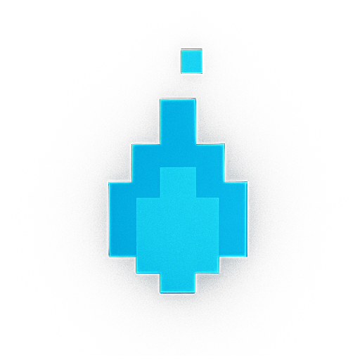

---
hide:
  - navigation
  - toc
---

<div class="hero" markdown>

{ .hero-logo }

<p class="hero-wordmark">AVLite</p>

# Autonomy, made lite

AVLite is a lightweight, modular autonomous-vehicle stack for perception,
planning, and control — from a 2D simulator on your laptop to headless
deployment on a real robot.

```bash
pip install avlite   # install
avlite               # launch the visualizer
```

[Get Started](quick-start.md){ .md-button .md-button--primary }
[Overview](overview.md){ .md-button }
[GitHub](https://github.com/AV-Lab/avlite){ .md-button }

<p class="hero-badges">
  
  
  
  
</p>

</div>

<div class="value-strip" markdown>

:material-check-decagram: BasicSim included &nbsp;&middot;&nbsp; :material-car-multiple: CARLA / Gazebo / ROS2 ready &nbsp;&middot;&nbsp; :material-monitor-dashboard: GUI + headless &nbsp;&middot;&nbsp; :material-language-python: Pure Python

</div>

<div class="grid cards" markdown>

-   :material-rocket-launch:{ .lg .middle } &nbsp; **Quick Start**

    ---

    Install, launch the visualizer, and drive the built-in simulator in minutes.

    [:octicons-arrow-right-24: Get started](quick-start.md)

-   :material-sitemap:{ .lg .middle } &nbsp; **Architecture**

    ---

    Layered strategy pattern with auto-registration and a capability system.

    [:octicons-arrow-right-24: How it fits together](architecture.md)

-   :material-map-marker-path:{ .lg .middle } &nbsp; **Algorithms**

    ---

    Global and local planning, including a greedy Frenet lattice planner.

    [:octicons-arrow-right-24: Planning internals](algorithms.md)

-   :material-puzzle:{ .lg .middle } &nbsp; **Plugin System**

    ---

    Add perception, planning, control, or world-bridge strategies as plugins.

    [:octicons-arrow-right-24: Build a plugin](plugin-development.md)

-   :material-cog:{ .lg .middle } &nbsp; **Configuration**

    ---

    YAML profiles with schema validation, tooltips, and import/export.

    [:octicons-arrow-right-24: Settings naming](settings-naming.md)

-   :material-book-open-variant:{ .lg .middle } &nbsp; **Full Overview**

    ---

    Features, installation, components, and configuration in one place.

    [:octicons-arrow-right-24: Read the overview](overview.md)

</div>

<figure class="shot" markdown="span">
  <span class="shot-frame">
    <span class="shot-bar"><span></span><span></span><span></span></span>
    
  </span>
  <figcaption>Real-time Tk visualizer: live plots, per-layer tuning, and profile management.</figcaption>
</figure>

## Why AVLite

<div class="grid cards" markdown>

-   :material-feather:{ .lg .middle } &nbsp; **Lightweight**

    ---

    The core stack needs only NumPy, Matplotlib, SciPy, Shapely, NetworkX, and
    Pydantic. No middleware lock-in.

-   :material-swap-horizontal:{ .lg .middle } &nbsp; **Modular**

    ---

    Swap perception, localization, planning, and control strategies at runtime —
    they auto-register and appear in the UI.

-   :material-robot-outline:{ .lg .middle } &nbsp; **Sim to robot**

    ---

    The same YAML profile drives the GUI and headless mode, so what you see in
    the visualizer is what the robot runs.

-   :material-earth:{ .lg .middle } &nbsp; **Multi-simulator**

    ---

    BasicSim ships built in; CARLA, Gazebo, and ROS2 plug in through optional
    world-bridge plugins.

</div>

<div class="hero-cta" markdown>

## Ready to drive?

```bash
pip install avlite
```

[Get Started](quick-start.md){ .md-button .md-button--primary }
[Browse the docs](overview.md){ .md-button }

</div>
