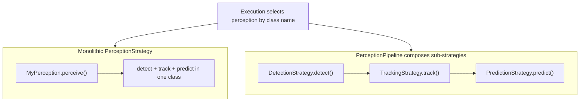

# Plugin Development

AVLite supports two types of plugins:
- **Built-in plugins** (`avlite/plugins/`): Maintained by the core team
- **Community plugins**: External directories you create and register

This guide covers creating community plugins. Classes inheriting from base strategies automatically register and appear in the UI.

## What you can extend

| Layer | Base classes | UI / config |
|-------|--------------|-------------|
| **Perception** | `PerceptionStrategy` **or** `DetectionStrategy` / `TrackingStrategy` / `PredictionStrategy` via `PerceptionPipeline` | Main **Perception** dropdown; pipeline sub-dropdowns (Detect / Track / Predict) appear only when `PerceptionPipeline` is selected |
| **Localization** | `LocalizationStrategy` | Separate **Localization** dropdown (optional; independent of perception) |
| **Mapping** | `MappingStrategy` | Extendable via plugin; registry-based like other strategies |
| **Planning** | `GlobalPlannerStrategy`, `LocalPlanningStrategy` | Global / local planner dropdowns |
| **Control** | `ControlStrategy` | Controller dropdown |
| **Execution** | `WorldBridge` | **Bridge** dropdown (BasicSim, Carla, Gazebo, ROS2, or custom) |

### Perception: monolithic vs pipeline

Perception is the most flexible layer — you can replace the whole stack in one class, or plug in individual stages.



**Monolithic (`PerceptionStrategy`):**

- Implement all stages in one `perceive()` method.
- Select your class name in the main **Perception** dropdown, or set `c40_perception` in `c40_execution.yaml` / `perception_type` in the visualization profile.
- Example built-in: `MultiObjectPredictor` (`p10_perception_MO_prediction`).

**Pipelined (`PerceptionPipeline` + sub-strategies):**

- Set perception to **`PerceptionPipeline`** in the main dropdown.
- The GUI shows **Detect**, **Track**, and **Predict** sub-dropdowns (only visible in pipeline mode).
- Configure sub-strategies in `configs/c10_perception.yaml`:

```yaml
c12_detection_strategy: MyDetector      # empty → ground truth from bridge
c12_tracking_strategy: MyTracker        # empty → ground truth from bridge
c12_prediction_strategy: MyPredictor    # empty → prediction stage skipped
```

- Each sub-strategy has its **own registry**; plugin classes auto-register like monolithic strategies.
- Empty or unknown name: detection/tracking fall back to **ground truth** from the world bridge when available; prediction is skipped if unset.
- Mix core and plugin sub-strategies freely (e.g. core `FastBEVLidarDetection` + plugin `MyPredictor`).

**Localization** is separate from `PerceptionPipeline`: optional `LocalizationStrategy` in its own dropdown; updates `PerceptionModel.ego_vehicle` in-place.

### Planning, control, and world bridge

- **Planning** — subclass `GlobalPlannerStrategy` (`plan()`) or `LocalPlanningStrategy` (`replan()`); selected via global/local planner dropdowns; configured in `c40_execution.yaml` (`c40_global_planner`, `c40_local_planner`).
- **Control** — subclass `ControlStrategy` (`control()`); selected via controller dropdown (`c40_controller`).
- **World bridge** — subclass `WorldBridge`; implement sensor getters and `control_ego_state()`; selected via **Bridge** dropdown (`c40_bridge`). See built-in `p40_bridge_*` plugins for reference.

## Community Plugin Structure

Create your plugin anywhere on your system:

```
/path/to/my_plugin/
├── __init__.py      # Export classes
├── settings.py      # Optional: PluginSettings if you have tunable params
├── config/          # Created on Save: my_plugin.yaml profiles
└── my_strategy.py   # Your implementation
```

Do not commit a `.venv` inside your plugin directory — AVLite scans all `.py` files under the plugin path and skips common vendor folders (`.venv`, `site-packages`, etc.), but keeping the venv outside the plugin tree is cleaner.

## 1. Settings File (Optional)

If your plugin has tunable parameters, add `settings.py` with a `PluginSettings` class. AVLite creates settings widgets automatically and saves profiles to `<plugin_path>/config/<plugin_name>.yaml` — you do **not** need `exclude` or `filepath`; those are injected when the plugin is registered.

```python
# settings.py
class PluginSettings:
    # Your parameters (appear in UI automatically)
    my_param: float = 1.0
```

Optionally add a `PluginSettingsSchema` (Pydantic) with `Field(description=...)` for tooltips in the settings window, same as built-in plugins.

Built-in plugins under `avlite/plugins/` are different: they set `filepath = "configs/plugin_*.yaml"` explicitly so shipped defaults live in the repository `configs/` directory.

## 2. Example: Custom Perception (Monolithic)

```python
from avlite.c10_perception.c12_perception_strategy import PerceptionStrategy
from avlite.c60_common.c61_capabilities import WorldCapability, PerceptionCapability
from .settings import PluginSettings

class MyPerception(PerceptionStrategy):
    def __init__(self, perception_model, setting=None):
        super().__init__(perception_model, setting)
    
    @property
    def requirements(self) -> set[WorldCapability]:
        return {WorldCapability.CAMERA_RGB, WorldCapability.LIDAR_3D}
    
    @property
    def capabilities(self) -> set[PerceptionCapability]:
        return {PerceptionCapability.DETECTION, PerceptionCapability.TRACKING,
                PerceptionCapability.PREDICTION}
    
    def perceive(self, rgb_img=None, depth_img=None, lidar_data=None,
                 perception_model=None):
        # Fuse camera and LiDAR to detect, track, and predict agents
        # Update self.perception_model.agents in-place, then return it
        return self.perception_model
```

## 3. Example: Detection, Tracking, or Prediction Sub-Strategy

Use `DetectionStrategy`, `TrackingStrategy`, or `PredictionStrategy` when you only need
to implement one stage of the pipeline. These plug into `PerceptionPipeline` and are
selected by name when **Perception** is set to `PerceptionPipeline`.

```python
from avlite.c10_perception.c12_perception_strategy import DetectionStrategy
from avlite.c60_common.c61_capabilities import WorldCapability
from avlite.c10_perception.c11_perception_model import PerceptionModel

class MyDetector(DetectionStrategy):
    @property
    def requirements(self) -> set[WorldCapability]:
        return {WorldCapability.CAMERA_RGB}

    def detect(self, perception_model: PerceptionModel,
               rgb_img=None, depth_img=None, lidar_data=None) -> PerceptionModel:
        # Your detection logic here
        return perception_model
```

```python
from avlite.c10_perception.c12_perception_strategy import TrackingStrategy
from avlite.c60_common.c61_capabilities import WorldCapability
from avlite.c10_perception.c11_perception_model import PerceptionModel

class MyTracker(TrackingStrategy):
    @property
    def requirements(self) -> set[WorldCapability]:
        return set()

    def track(self, perception_model: PerceptionModel) -> PerceptionModel:
        # Your tracking logic here
        return perception_model
```

```python
from avlite.c10_perception.c12_perception_strategy import PredictionStrategy
from avlite.c60_common.c61_capabilities import WorldCapability
from avlite.c10_perception.c11_perception_model import PerceptionModel

class MyPredictor(PredictionStrategy):
    @property
    def requirements(self) -> set[WorldCapability]:
        return set()

    def predict(self, perception_model: PerceptionModel) -> PerceptionModel | None:
        # Your prediction logic here
        return perception_model
```

Configure pipeline sub-strategies in `configs/c10_perception.yaml`:

```yaml
c12_detection_strategy: MyDetector
c12_tracking_strategy: MyTracker
c12_prediction_strategy: MyPredictor
```

## 4. Example: Custom Localization

Localization strategies estimate the ego vehicle’s pose and update
`self.perception_model.ego_vehicle` **in-place** (no return value).

```python
from avlite.c10_perception.c13_localization_strategy import LocalizationStrategy
from avlite.c60_common.c61_capabilities import WorldCapability, LocalizationCapability

class MyLocalization(LocalizationStrategy):
    def __init__(self, perception_model, setting=None):
        super().__init__(perception_model, setting)
    
    @property
    def requirements(self) -> set[WorldCapability]:
        return {WorldCapability.LIDAR_3D}
    
    @property
    def capabilities(self) -> set[LocalizationCapability]:
        return {LocalizationCapability.LOCALIZATION_2D, LocalizationCapability.LOCALIZATION_HEADING}
    
    def localize(self, imu=None, lidar=None, rgb_img=None) -> None:
        # Estimate the ego pose from sensor data and update in-place
        if lidar is not None:
            # ... your scan-matching / localization logic ...
            self.perception_model.ego_vehicle.x = estimated_x
            self.perception_model.ego_vehicle.y = estimated_y
            self.perception_model.ego_vehicle.theta = estimated_theta
    
    def reset(self):
        pass
```

## 5. Example: Custom Planner

```python
from avlite.c20_planning.c23_local_planning_strategy import LocalPlanningStrategy

class MyLocalPlanner(LocalPlanningStrategy):
    def replan(self, perception_model, global_trajectory=None):
        # Your local planning logic; return a Trajectory or None
        return self.local_trajectory
```

## 6. Example: Custom Controller

```python
from avlite.c30_control.c32_control_strategy import ControlStrategy
from avlite.c30_control.c31_control_model import ControlComand

class MyController(ControlStrategy):
    def control(self, ego, tj=None, control_dt=None) -> ControlComand:
        # Your logic here
        return ControlComand(throttle=1.0, steer=0.0)
    
    def reset(self):
        pass
```

## 7. Example: Custom World Bridge

```python
from avlite.c40_execution.c41_world_bridge import WorldBridge
from avlite.c60_common.c61_capabilities import WorldCapability

class MyBridge(WorldBridge):
    @property
    def capabilities(self) -> set[WorldCapability]:
        return {WorldCapability.LIDAR_2D, WorldCapability.GT_LOCALIZATION}

    def control_ego_state(self, throttle, brake, steer, dt):
        # Send control to your simulator or robot
        pass
```

## 8. Export Classes

```python
# __init__.py
from .my_strategy import MyPerception, MyLocalization, MyController
from .settings import PluginSettings

__all__ = ["MyPerception", "MyLocalization", "MyController", "PluginSettings"]
```

When you rename a module file, update the import path in `__init__.py` to match (e.g. `from .p31_joystick_controller import JoystickController`).

## 9. Register Your Community Plugin

**Via GUI** (recommended):
1. Open AVLite
2. Go to Config tab
3. Add entry under community plugins: `my_plugin` -> `/path/to/my_plugin`
4. Save profile

**Via settings file** (`configs/c40_execution.yaml` or your saved copy under `~/.config/avlite/`):

```yaml
c40_community_plugins:
  my_plugin: /path/to/my_plugin
```

When a plugin is installed through `python -m avlite plugins`, its path is stored under `~/.local/share/avlite/plugins/` (override with `AVLITE_PLUGINS_DIR`).

Your classes will now appear in the UI dropdowns.

## 10. Publish to the community registry (pull request)

To list your plugin in every user's **Plugins** browser (`python -m avlite plugins`), add it to the official registry via pull request.

Registry repository: [github.com/AV-Lab/avlite-community-plugins](https://github.com/AV-Lab/avlite-community-plugins)

### Before you open a PR

1. **Test locally** — register the plugin on a profile (section 9) and confirm your strategies appear in the GUI dropdowns and the stack runs.
2. **Public Git repository** — the registry clones your repo; private repos will not install for other users.
3. **Plugin layout** — at minimum:
   ```
   my_cool_planner/
   ├── __init__.py       # exports strategy classes (required for discovery)
   ├── my_planner.py     # your implementation
   └── README.md         # shown in the Plugins browser (recommended)
   ```
4. **Optional** — `settings.py` with `PluginSettings` if you have tunable parameters; `requirements.txt` if you depend on extra pip packages (users install these into their AVLite environment).
5. **Do not commit** a `.venv` inside the plugin repo.

### Registry entry

Fork [avlite-community-plugins](https://github.com/AV-Lab/avlite-community-plugins), add one item under `plugins:` in `plugins.yaml`, and open a pull request:

```yaml
plugins:
  - name: my_perception_plugin
    description: One-line summary of what the plugin does
    repository: https://github.com/your-org/your-plugin-repo
    version: latest              # or a git tag / commit SHA
    author: your-org
    category:
      - PerceptionStrategy
```

| Field | Notes |
|-------|-------|
| `name` | Unique registry id; also the install folder name under `~/.local/share/avlite/plugins/`. Use lowercase with underscores. |
| `description` | Short text in the plugin list. |
| `repository` | HTTPS Git URL (GitHub is supported for README preview in the browser). |
| `version` | `latest` clones the default branch; pin a tag or SHA for reproducible installs. |
| `author` | Display name, handle, or organization. |
| `category` | List of strategy types this plugin provides (see table below). Shown in the Plugins browser **Category** column. |

**Category values** (use the names from [avlite-community-plugins](https://github.com/AV-Lab/avlite-community-plugins)):

| Category | Use when your plugin implements… |
|----------|----------------------------------|
| `PerceptionStrategy` | Sensing, detection, tracking, segmentation, fusion (includes monolithic perception and pipeline sub-strategies such as `DetectionStrategy`) |
| `LocalizationStrategy` | Pose estimation, SLAM-based localization |
| `MappingStrategy` | Map building, SLAM mapping, environment representation |
| `PlanningStrategy` | Global/local planners, behavior planning, decision-making |
| `ControlStrategy` | Vehicle controllers, actuation |
| `Executer` | Runtime execution, scheduling, orchestration |
| `WorldBridge` | Bridges to simulators, middleware, or external world interfaces |

A plugin can list **multiple** categories if it exports more than one strategy type, e.g. `[PerceptionStrategy, LocalizationStrategy]`.

Keep entries sorted alphabetically by `name` if the registry already follows that convention.

### Pull request checklist

- [ ] Plugin works when registered manually (section 9)
- [ ] Repository is public and cloneable
- [ ] `__init__.py` exports all strategy classes users should select
- [ ] README explains what the plugin provides and any extra setup
- [ ] Registry `name` matches how you refer to the plugin in docs
- [ ] Registry `category` matches the base class(es) you export
- [ ] No secrets, large binaries, or committed virtualenv in the plugin repo

In the PR description, briefly state what layer(s) the plugin extends (perception, planning, control, bridge, etc.) and link to an example profile or usage steps if helpful.

### After merge

Once the PR is merged to `main`, AVLite fetches the updated registry automatically the next time a user opens **Plugins** (`python -m avlite plugins`). They can **Install**, then **Register** to add the plugin to their active execution profile (`c40_community_plugins`).

You do not need a new AVLite release for registry-only changes.

### Updating your listing

- **New plugin version** — push to your repo; users click **Update** in the Plugins browser (or reinstall). Bump `version` in `plugins.yaml` if you want to pin a new tag/SHA for fresh installs.
- **Change metadata** — open another PR on avlite-community-plugins to edit `description`, `author`, `category`, or `version`.

## 11. Built-in plugin naming (`pNx`)

Built-in plugins under `avlite/plugins/` use a **directory name** and optional **module file names** with a `pNx` prefix:

- **Directory:** `p{layer}{variant}_{description}` — e.g. `p30_controller_joystick`, `p40_executer_ROS2`
- **Module files:** use the same convention when the file belongs to a specific layer — e.g. `p31_joystick_controller.py`, `p42_perception_node.py`

The **first digit after `p`** maps to the log-panel layer toggle:

| Digit | Layer |
|-------|-------|
| 1 | Perception |
| 2 | Planning |
| 3 | Control |
| 4 | Execution |
| 5 | Visualization |
| 6 | Common |

The plugin **directory name** and **module file name** can differ. For example, package `p30_controller_joystick` may contain module `p31_joystick_controller.py`.

Logger names follow Python's `__name__`, e.g. `avlite.plugins.p30_controller_joystick.p31_joystick_controller`. Log routing uses the **first module segment** under the package (`p31_joystick_controller`) before falling back to the directory name.

## 12. Log panel filtering

The visualizer log toolbar provides:

- **Core** — master toggle for all core stack logs (`avlite.c10_*` … `avlite.c60_*`). Does not change the per-layer checkbox states.
- **Plugins** — master toggle for all `avlite.plugins.*` logs.
- **Per-layer checkboxes** (Perception, Planning, Control, Execution, Visualization, Common) — filter core logs and plugin logs routed to that layer.

Plugin logs are routed to a layer toggle as follows:

1. Take the **first module segment** under the plugin package (e.g. `p31_joystick_controller` from `avlite.plugins.p30_controller_joystick.p31_joystick_controller`).
2. If it matches `pNx`, use that digit for the layer.
3. Otherwise fall back to the **plugin directory name** (e.g. `p40_bridge_carla` for `carla_bridge` module).
4. If still no `pNx` match (typical community plugins), the log is shown whenever **Plugins** is on.

| Logger | Module segment | Layer source |
|--------|----------------|--------------|
| `...p30_controller_joystick.p31_joystick_controller` | `p31_joystick_controller` | module → Control |
| `...p40_bridge_carla.carla_bridge` | `carla_bridge` | package fallback → Execution |
| `...p40_executer_ROS2.p42_perception_node` | `p42_perception_node` | module → Execution |
| `...sample_avlite_plugin.test_plugin` | `test_plugin` | no pNx → Plugins master only |

Filtering reads a thread-safe snapshot updated on the main thread only (safe when worker threads emit logs during execution).

## Base Classes Reference

| Base Class | Purpose | Key Method |
|------------|---------|------------|
| `PerceptionStrategy` | Monolithic detection/tracking/prediction | `perceive()` |
| `DetectionStrategy` | Detection sub-strategy (used by `PerceptionPipeline`) | `detect()` |
| `TrackingStrategy` | Tracking sub-strategy (used by `PerceptionPipeline`) | `track()` |
| `PredictionStrategy` | Prediction sub-strategy (used by `PerceptionPipeline`) | `predict()` |
| `LocalizationStrategy` | Localization | `localize()` |
| `MappingStrategy` | Mapping | TBD |
| `LocalPlanningStrategy` | Local planning | `replan()` |
| `GlobalPlannerStrategy` | Global planning | `plan()` |
| `ControlStrategy` | Vehicle control | `control()` |
| `WorldBridge` | Simulator integration | `control_ego_state()` |

## See Also

Built-in plugins in `avlite/plugins/` (maintained by core team):
- `p40_bridge_carla` — CARLA simulator world bridge
- `p40_bridge_gazebo` — Gazebo Ignition world bridge
- `p40_bridge_ROS2` — ROS2 world bridge
- `p40_executer_ROS2` — ROS2 executor with Autoware message support
- `p10_perception_MO_prediction` — Multi-object prediction perception
- `p30_controller_joystick` — Xbox-style joystick controller
- `p50_headless_mode` — Headless runner and config CLI

Settings for built-in plugins: `configs/plugin_*.yaml` in the repo (same basename under `~/.config/avlite/` when saved).
