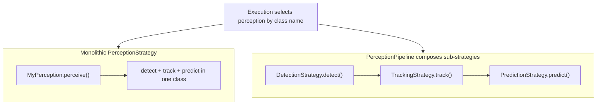
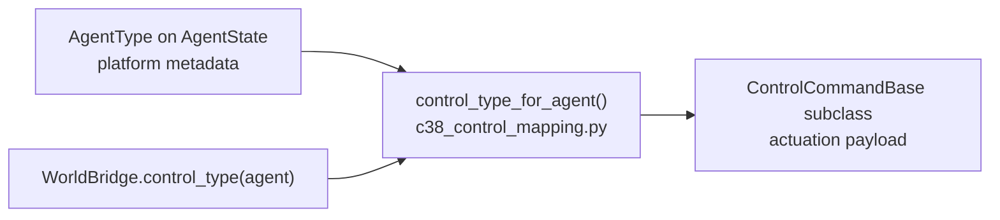

# Plugin Development

AVLite supports three types of plugins:
- **Built-in plugins** (`avlite/plugins/`): Maintained by the core team
- **Community plugins**: Public registry via pull request to [avlite-community-plugins](https://github.com/AV-Lab/avlite-community-plugins)
- **Member plugins**: AV-Lab private registry ([avlite-private-plugins](https://github.com/AV-Lab/avlite-private-plugins)); browse/install via the **Members** tab after GitHub sign-in

This guide covers creating community plugins. Classes inheriting from base strategies automatically register and appear in the UI.

## What you can extend

| Layer | Base classes | UI / config |
|-------|--------------|-------------|
| **Perception** | `PerceptionStrategy` **or** `DetectionStrategy` / `TrackingStrategy` / `PredictionStrategy` via `PerceptionPipeline` | Main **Perception** dropdown; pipeline sub-dropdowns (Detect / Track / Predict) appear only when `PerceptionPipeline` is selected |
| **Localization** | `LocalizationStrategy` | Separate **Localization** dropdown (optional; independent of perception) |
| **Mapping** | `MappingStrategy` | Extendable via plugin; registry-based like other strategies |
| **Planning** | `GlobalPlannerStrategy`, `LocalPlanningStrategy` | Global / local planner dropdowns |
| **Control** | `ControlStrategy` | Controller dropdown |
| **Execution** | `WorldBridge` | **Bridge** dropdown (BasicSim, Carla, Gazebo, ROS2, or custom) |

### Perception: monolithic vs pipeline

Perception is the most flexible layer — you can replace the whole stack in one class, or plug in individual stages.



**Monolithic (`PerceptionStrategy`):**

- Implement all stages in one `perceive()` method.
- Select your class name in the main **Perception** dropdown, or set `c40_perception` in `c40_execution.yaml` / `perception_type` in the visualization profile.
- Example built-in: `MultiObjectPredictor` (`p10_perception_MO_prediction`).

**Pipelined (`PerceptionPipeline` + sub-strategies):**

- Set perception to **`PerceptionPipeline`** in the main dropdown.
- The GUI shows **Detect**, **Track**, and **Predict** sub-dropdowns (only visible in pipeline mode).
- Configure sub-strategies in `configs/c10_perception.yaml`:

```yaml
c12_detection_strategy: MyDetector      # empty → ground truth from bridge
c12_tracking_strategy: MyTracker        # empty → ground truth from bridge
c12_prediction_strategy: MyPredictor    # empty → prediction stage skipped
```

- Each sub-strategy has its **own registry**; plugin classes auto-register like monolithic strategies.
- Empty name: detection/tracking use **ground truth** from the world bridge when available; prediction is skipped if unset.
- Non-empty unknown name: factory **raises on reload** (shown in the visualizer as "Reload failed").
- Mix core and plugin sub-strategies freely (e.g. core `FastBEVLidarDetection` + plugin `MyPredictor`).

**Localization** is separate from `PerceptionPipeline`: optional `LocalizationStrategy` in its own dropdown; updates `PerceptionModel.ego_vehicle` in-place.

### Planning, control, and world bridge

- **Planning** — subclass `GlobalPlannerStrategy` (`plan()`) or `LocalPlanningStrategy` (`replan()`); selected via global/local planner dropdowns; configured in `c40_execution.yaml` (`c40_global_planner`, `c40_local_planner`).
- **Control** — subclass `ControlStrategy` (`control()`); selected via controller dropdown (`c40_controller`).
- **World bridge** — subclass `WorldBridge`; implement sensor getters and `control_ego_state()`; selected via **Bridge** dropdown (`c40_bridge`). See built-in `p40_bridge_*` plugins for reference.

## Community Plugin Structure

Create your plugin anywhere on your system:

```
/path/to/my_plugin/
├── __init__.py      # Export classes
├── settings.py      # Optional: PluginSettings if you have tunable params
├── my_strategy.py   # Your implementation
├── README.md        # Optional: shown in the Plugins browser
└── requirements.txt # Optional: extra pip dependencies
```

Tunable parameters are saved outside the plugin tree in `~/.config/avlite/plugin_<plugin_name>.yaml` (see section 1). Do not ship a `config/` folder or plugin-local YAML profiles in your repository.

Do not commit a `.venv` inside your plugin directory — AVLite scans all `.py` files under the plugin path and skips common vendor folders (`.venv`, `site-packages`, etc.), but keeping the venv outside the plugin tree is cleaner.

## 1. Settings File (Optional)

If your plugin has tunable parameters, add `settings.py` with a `PluginSettings` class. AVLite creates settings widgets automatically and saves profiles to `~/.config/avlite/plugin_<plugin_name>.yaml` (or under `AVLITE_CONFIG_DIR` if set). The filename uses the registry key / `c50_community_plugins` entry name — you do **not** need `exclude`, `filepath`, or a `config/` folder in your plugin package; AVLite derives the settings path when the plugin is registered and loaded.

```python
# settings.py
class PluginSettings:
    # Your parameters (appear in UI automatically)
    my_param: float = 1.0
```

Optionally add a `PluginSettingsSchema` (Pydantic) with `Field(description=...)` for tooltips in the settings window, same as built-in plugins.

If `~/.config/avlite/plugin_<plugin_name>.yaml` does not exist yet, AVLite may still **read** a legacy file at `<install>/config/<plugin_name>.yaml` from older setups; new saves always go to the user config directory.

Built-in plugins under `avlite/plugins/` are different: they set `filepath = "configs/plugin_*.yaml"` explicitly so shipped defaults live in the repository `configs/` directory and fall back from the user config dir on load.

## 2. Example: Custom Perception (Monolithic)

```python
from avlite.c10_perception.c12_perception_strategy import PerceptionStrategy
from avlite.c60_common.c61_capabilities import WorldCapability, PerceptionCapability
from .settings import PluginSettings

class MyPerception(PerceptionStrategy):
    def __init__(self, perception_model, setting=None):
        super().__init__(perception_model, setting)
    
    @property
    def requirements(self) -> set[WorldCapability]:
        return {WorldCapability.CAMERA_RGB, WorldCapability.LIDAR_3D}
    
    @property
    def capabilities(self) -> set[PerceptionCapability]:
        return {PerceptionCapability.DETECTION, PerceptionCapability.TRACKING,
                PerceptionCapability.PREDICTION}
    
    def perceive(self, rgb_img=None, depth_img=None, lidar_data=None,
                 perception_model=None):
        # Fuse camera and LiDAR to detect, track, and predict agents
        # Update self.perception_model.agents in-place, then return it
        return self.perception_model
```

## 3. Example: Detection, Tracking, or Prediction Sub-Strategy

Use `DetectionStrategy`, `TrackingStrategy`, or `PredictionStrategy` when you only need
to implement one stage of the pipeline. These plug into `PerceptionPipeline` and are
selected by name when **Perception** is set to `PerceptionPipeline`.

```python
from avlite.c10_perception.c12_perception_strategy import DetectionStrategy
from avlite.c60_common.c61_capabilities import WorldCapability
from avlite.c10_perception.c11_perception_model import PerceptionModel

class MyDetector(DetectionStrategy):
    @property
    def requirements(self) -> set[WorldCapability]:
        return {WorldCapability.CAMERA_RGB}

    def detect(self, perception_model: PerceptionModel,
               rgb_img=None, depth_img=None, lidar_data=None) -> PerceptionModel:
        # Your detection logic here
        return perception_model
```

```python
from avlite.c10_perception.c12_perception_strategy import TrackingStrategy
from avlite.c60_common.c61_capabilities import WorldCapability
from avlite.c10_perception.c11_perception_model import PerceptionModel

class MyTracker(TrackingStrategy):
    @property
    def requirements(self) -> set[WorldCapability]:
        return set()

    def track(self, perception_model: PerceptionModel) -> PerceptionModel:
        # Your tracking logic here
        return perception_model
```

```python
from avlite.c10_perception.c12_perception_strategy import PredictionStrategy
from avlite.c60_common.c61_capabilities import WorldCapability
from avlite.c10_perception.c11_perception_model import PerceptionModel

class MyPredictor(PredictionStrategy):
    @property
    def requirements(self) -> set[WorldCapability]:
        return set()

    def predict(self, perception_model: PerceptionModel) -> PerceptionModel | None:
        # Your prediction logic here
        return perception_model
```

Configure pipeline sub-strategies in `configs/c10_perception.yaml`:

```yaml
c12_detection_strategy: MyDetector
c12_tracking_strategy: MyTracker
c12_prediction_strategy: MyPredictor
```

## 4. Example: Custom Localization

Localization strategies estimate the ego vehicle’s pose and update
`self.perception_model.ego_vehicle` **in-place** (no return value).

```python
from avlite.c10_perception.c13_localization_strategy import LocalizationStrategy
from avlite.c60_common.c61_capabilities import WorldCapability, LocalizationCapability

class MyLocalization(LocalizationStrategy):
    def __init__(self, perception_model, setting=None):
        super().__init__(perception_model, setting)
    
    @property
    def requirements(self) -> set[WorldCapability]:
        return {WorldCapability.LIDAR_3D}
    
    @property
    def capabilities(self) -> set[LocalizationCapability]:
        return {LocalizationCapability.LOCALIZATION_2D, LocalizationCapability.LOCALIZATION_HEADING}
    
    def localize(self, imu=None, lidar=None, rgb_img=None) -> None:
        # Estimate the ego pose from sensor data and update in-place
        if lidar is not None:
            # ... your scan-matching / localization logic ...
            self.perception_model.ego_vehicle.x = estimated_x
            self.perception_model.ego_vehicle.y = estimated_y
            self.perception_model.ego_vehicle.theta = estimated_theta
    
    def reset(self):
        pass
```

## 5. Example: Custom Planner

```python
from avlite.c20_planning.c23_local_planning_strategy import LocalPlanningStrategy

class MyLocalPlanner(LocalPlanningStrategy):
    def replan(self, perception_model, global_trajectory=None):
        # Your local planning logic; return a Trajectory or None
        return self.local_trajectory
```

## 6. Example: Custom Controller

```python
from avlite.c30_control.c32_control_strategy import ControlStrategy
from avlite.c30_control.c31_control_model import ControlCommand, ControlCommandBase

class MyController(ControlStrategy):
    def control(self, ego, tj=None, control_dt=None) -> ControlCommandBase:
        # Your logic here; ControlCommand is an alias for AckermannControlCommand
        return ControlCommand(steer=0.0, acceleration=1.0)

    def reset(self):
        pass
```

## 7. Multi-robot agents and control

AVLite separates **what an agent is** (platform metadata) from **how it is actuated** (control command payload). Phase 1 adds the structure; the executer still drives ego via `control_ego_state` only. Multi-agent actuation and physics sub-stepping are reserved for later.

### Agent identity

| ID | Role |
|----|------|
| `EGO_AGENT_ID = 0` | Ego vehicle (`EgoState` in `perception_model.ego_vehicle`) |
| `1, 2, 3, …` | NPCs in `perception_model.agent_vehicles` (assigned by `add_agent_vehicle`) |

```python
from avlite.c10_perception.c11_perception_model import AgentState, AgentType, EGO_AGENT_ID

npc = AgentState(x=10.0, y=0.0, agent_type=AgentType.DIFF_DRIVE)
agent_id = perception_model.add_agent_vehicle(npc)  # returns 1, 2, ...
```

IDs are stable integers — not `Enum.auto()` values and not random — so bridges, logs, and tracking stay debuggable.

### Two layers (do not conflate)



- **`AgentType`** — platform category on [`AgentState`](../avlite/c10_perception/c11_perception_model.py) (Ackermann car, diff-drive, aerial, pedestrian, …).
- **Control command classes** — actuation payload in [`c31_control_model.py`](../avlite/c30_control/c31_control_model.py); default mapping in [`c38_control_mapping.py`](../avlite/c30_control/c38_control_mapping.py).

### Default control mapping

| `AgentType` | Command class | Fields |
|-------------|---------------|--------|
| `ACKERMANN` | `AckermannControlCommand` | `steer`, `acceleration` |
| `DIFF_DRIVE`, `CYCLIST` | `DiffDriveControlCommand` | `linear`, `angular` |
| `AERIAL`, `SURFACE_VESSEL`, `UNDERWATER`, `PEDESTRIAN`, `DYNAMIC_OBJECT` | `BodyVelocityControlCommand` | `vx`, `vy`, `vz`, `yaw_rate` |

Set `agent_type` when spawning non-car NPCs. Do not infer platform type from `agent_id` — use `agent.agent_type`.

### Backward compatibility

- `ControlCommand` and `ControlComand` remain aliases for **`AckermannControlCommand`** only.
- Existing car stack code needs no changes; polymorphic APIs use **`ControlCommandBase`**.
- Use `isinstance(cmd, ControlCommandBase)` for any command type; `isinstance(cmd, ControlCommand)` matches Ackermann only.

### WorldBridge API (phase 1 vs future)

| Method | Phase 1 today | Future |
|--------|---------------|--------|
| `control_ego_state(cmd)` | Required; all bridges implement this | Unchanged |
| `control_type(agent)` | Default: `control_type_for_agent(agent)` | Override only for bridge-specific exceptions |
| `control_agent(id, cmd)` | Default: ego delegates to `control_ego_state`; NPC raises `NotImplementedError` | Override + declare `WorldCapability.AGENT_CONTROL` |
| `teleport_agent(id, x, y, theta)` | Default: ego delegates to `teleport_ego`; NPC raises `NotImplementedError` | Override for sim teleport of any agent |
| `get_*(agent_id=EGO_AGENT_ID)` | Default: ego returns data or `None`; NPC raises `NotImplementedError` | Per-agent sensors in Carla / ROS bridges |
| `get_sensor_frame(agent_id=...)` | Ego: calls legacy `get_*()` with no kwargs (BasicSim-compatible) | Non-ego: passes `agent_id` to each getter |
| `step(dt)` | Default no-op; executer does not call it yet | Physics tick with held command; executer sub-stepping |

`control_type(agent)` lives on **`WorldBridge` only** — not on `ControlStrategy`. The bridge knows what actuation format the sim or robot accepts; the controller expresses what it computes via the return type of `control()`.

**Multi-agent sensors:** override getters with an `agent_id` parameter when your bridge serves more than ego. Ego-only bridges (e.g. BasicSim) need no update — `get_sensor_frame()` uses the legacy no-kwargs call path for ego.

### State model — today vs future

**Today:** `AgentState` uses pose (`x`, `y`, `z`, `theta`) plus scalar **`velocity`** (speed along heading). This matches the car-centric stack (planning, collision checking, BasicSim, visualization).

**Aerial / holonomic agents:** `BodyVelocityControlCommand` is defined, but base `AgentState` does not yet carry `vx`, `vy`, or `vz`. For 2D / bird's-eye use cases, heading plus scalar speed is an acceptable lite projection. Full drone or multirotor simulation needs richer state later.

**Future pattern:** subclass when kinematics diverge — for example `DroneAgentState(AgentState)` with body or world velocity fields and custom `predict()` / integration. Same idea as `EgoState(AgentState)`. Lists typed as `list[AgentState]` accept subclasses. Keep **`agent_type`** for dispatch; use the **subclass** for extra fields and integration logic.

### Plugin author checklist

- Set `agent_type` at spawn for non-car NPCs.
- Return the command type your controller produces; built-in controllers still return Ackermann today.
- Bridge: implement only what you need now (`control_ego_state`); opt into `control_agent` and `AGENT_CONTROL` when the sim supports NPC actuation.
- Do not branch on `agent_id` heuristics for platform type — use `agent.agent_type`.
- Converters (Ackermann → diff-drive, etc.) are **not in core yet**; keep them in your plugin until a shared module (e.g. `c38_control_converters.py`) lands.

### Prediction models on `PerceptionModel`

Forecast payloads live on a single typed object: **`perception_model.prediction`**. Per-agent types store data in **`dict[int, …]` keyed by `agent_id`** (not list index). The lump-sum occupancy type is **`AggregatedOccupancyFlow`** (one grid sequence for the whole scene).

```python
from avlite.c10_perception.c11_perception_model import PerceptionModel, SingleTrajectory

pm.prediction = SingleTrajectory(
    predict_delta_t=0.1,
    trajectories={agent.agent_id: path_xy for agent in pm.agent_vehicles},
)
path = pm.prediction.trajectories.get(agent.agent_id)  # [n_steps, 2] world x,y [m]
```

**Timesteps — do not mix tracking and prediction:**

| YAML key | Stage | Used by |
|----------|-------|---------|
| `c11_predict_delta_t` | Forecast | Default `predict_delta_t` on prediction objects; collision step indexing |
| `c15_tracking_dt` | Tracking | Kalman filter only (`KalmanTracker._dt`) |

## 8. Example: Custom World Bridge

```python
from avlite.c10_perception.c11_perception_model import EGO_AGENT_ID
from avlite.c40_execution.c41_world_bridge import WorldBridge
from avlite.c30_control.c31_control_model import ControlCommandBase
from avlite.c60_common.c61_capabilities import WorldCapability

class MyBridge(WorldBridge):
    @property
    def capabilities(self) -> set[WorldCapability]:
        return {WorldCapability.LIDAR_2D, WorldCapability.GT_LOCALIZATION}

    def control_ego_state(self, cmd: ControlCommandBase, dt=0.01):
        # Send control to your simulator or robot
        pass

    # Optional (future): multi-agent fleets — declare WorldCapability.AGENT_CONTROL
    def control_agent(self, agent_id: int, cmd: ControlCommandBase, dt=0.01):
        if agent_id == EGO_AGENT_ID:
            return self.control_ego_state(cmd, dt=dt)
        # Resolve agent, optionally convert cmd, actuate in sim
        ...
```

`control_type(agent)` defaults to `control_type_for_agent(agent)` from [`c38_control_mapping.py`](../avlite/c30_control/c38_control_mapping.py). Use `world.step(dt)` to advance the sim without a new command from the stack (default no-op until a bridge overrides it and the executer wires sub-stepping).

## 9. Export Classes

```python
# __init__.py
from .my_strategy import MyPerception, MyLocalization, MyController
from .settings import PluginSettings

__all__ = ["MyPerception", "MyLocalization", "MyController", "PluginSettings"]
```

When you rename a module file, update the import path in `__init__.py` to match (e.g. `from .p31_joystick_controller import JoystickController`).

## 10. Register Your Community Plugin

**Via GUI** (recommended):
1. Open AVLite
2. Go to Config tab
3. Add entry under community plugins: `my_plugin` → install path (or use **Install** then **Register** from `python -m avlite plugins`)
4. Save profile

Double-click a community plugin in the list to view its **Package Name** and **Settings file** paths separately. **Reset to Installed** repopulates the list from plugin directories under the user install dir (`~/.local/share/avlite/plugins/`) and dev checkout dirs (`avlite-community-plugins/`, `avlite-private-plugins/`).

**Via settings file** (`configs/c59_apps.yaml` or your saved copy under `~/.config/avlite/`):

```yaml
c50_community_plugins:
  my_plugin: my_plugin                    # installed under ~/.local/share/avlite/plugins/
  dev_plugin: ~/src/my_plugin             # local dev checkout outside the plugins dir
```

The map value is the **install path**, not the settings YAML path. When a plugin lives under `~/.local/share/avlite/plugins/` (override install root with `AVLITE_PLUGINS_DIR`), AVLite stores the name sentinel (`my_plugin: my_plugin`). Paths outside that directory are stored as `~/...` or an absolute path. Plugin settings always live in `~/.config/avlite/plugin_<name>.yaml`, independent of the install location.

Your classes will now appear in the UI dropdowns.

## Member plugins (AV-Lab)

The **Members** tab in `python -m avlite plugins` lists plugins from the
[avlite-private-plugins](https://github.com/AV-Lab/avlite-private-plugins) registry.
This is separate from the public community registry.

**Access requirements:**

- Sign in with GitHub (Device Flow) in the Members tab
- Your GitHub account must have access to `AV-Lab/avlite-private-plugins` and to each listed plugin repository
- If your org uses SAML SSO, authorize the token when AVLite prompts you (403 with SSO link)
- If OAuth App access restrictions apply, an AV-Lab org admin must approve the AVLite OAuth app under **Organization Settings → Third-party access**

**Publishing:** Member plugins are listed by AV-Lab maintainers in the private registry (not via the community PR flow in section 11). Install and register work the same as community plugins once you are signed in; private repos use authenticated git clone.

See [Member plugins](../index.md#member-plugins) in the main docs for token storage and troubleshooting.

## 11. Publish to the community registry (pull request)

To list your plugin in every user's **Community** tab (`python -m avlite plugins`), add it to the official public registry via pull request.

Registry repository: [github.com/AV-Lab/avlite-community-plugins](https://github.com/AV-Lab/avlite-community-plugins)

### Before you open a PR

1. **Test locally** — register the plugin on a profile (section 10) and confirm your strategies appear in the GUI dropdowns and the stack runs.
2. **Public Git repository** — the registry clones your repo; private repos will not install for other users.
3. **Plugin layout** — at minimum:
   ```
   my_cool_planner/
   ├── __init__.py       # exports strategy classes (required for discovery)
   ├── my_planner.py     # your implementation
   └── README.md         # shown in the Plugins browser (recommended)
   ```
4. **Optional** — `settings.py` with `PluginSettings` if you have tunable parameters; `requirements.txt` if you depend on extra pip packages (users install these into their AVLite environment).
5. **Do not commit** a `.venv` inside the plugin repo.

### Registry entry

Fork [avlite-community-plugins](https://github.com/AV-Lab/avlite-community-plugins), add one item under `plugins:` in `plugins.yaml`, and open a pull request:

```yaml
plugins:
  - name: my_perception_plugin
    description: One-line summary of what the plugin does
    repository: https://github.com/your-org/your-plugin-repo
    version: latest              # or a git tag / commit SHA
    author: your-org
    category:
      - PerceptionStrategy
```

| Field | Notes |
|-------|-------|
| `name` | Unique registry id; also the install folder name under `~/.local/share/avlite/plugins/`. Use lowercase with underscores. |
| `description` | Short text in the plugin list. |
| `repository` | HTTPS Git URL (GitHub is supported for README preview in the browser). |
| `version` | `latest` clones the default branch; pin a tag or SHA for reproducible installs. |
| `author` | Display name, handle, or organization. |
| `category` | List of strategy types this plugin provides (see table below). Shown in the Plugins browser **Category** column. |

**Category values** (use the names from [avlite-community-plugins](https://github.com/AV-Lab/avlite-community-plugins)):

| Category | Use when your plugin implements… |
|----------|----------------------------------|
| `PerceptionStrategy` | Sensing, detection, tracking, segmentation, fusion (includes monolithic perception and pipeline sub-strategies such as `DetectionStrategy`) |
| `LocalizationStrategy` | Pose estimation, SLAM-based localization |
| `MappingStrategy` | Map building, SLAM mapping, environment representation |
| `PlanningStrategy` | Global/local planners, behavior planning, decision-making |
| `ControlStrategy` | Vehicle controllers, actuation |
| `Executer` | Runtime execution, scheduling, orchestration |
| `WorldBridge` | Bridges to simulators, middleware, or external world interfaces |

A plugin can list **multiple** categories if it exports more than one strategy type, e.g. `[PerceptionStrategy, LocalizationStrategy]`.

Keep entries sorted alphabetically by `name` if the registry already follows that convention.

### Pull request checklist

- [ ] Plugin works when registered manually (section 10)
- [ ] Repository is public and cloneable
- [ ] `__init__.py` exports all strategy classes users should select
- [ ] README explains what the plugin provides and any extra setup
- [ ] Registry `name` matches how you refer to the plugin in docs
- [ ] Registry `category` matches the base class(es) you export
- [ ] No secrets, large binaries, committed virtualenv, or `config/` folder with plugin-local YAML profiles in the plugin repo

In the PR description, briefly state what layer(s) the plugin extends (perception, planning, control, bridge, etc.) and link to an example profile or usage steps if helpful.

### After merge

Once the PR is merged to `main`, AVLite fetches the updated registry automatically the next time a user opens **Plugins** (`python -m avlite plugins`). They can **Install**, then **Register** to add the plugin to their active profile (`c50_community_plugins` in `c59_apps.yaml`).

You do not need a new AVLite release for registry-only changes.

### Updating your listing

- **New plugin version** — push to your repo; users click **Update** in the Plugins browser (or reinstall). Bump `version` in `plugins.yaml` if you want to pin a new tag/SHA for fresh installs.
- **Change metadata** — open another PR on avlite-community-plugins to edit `description`, `author`, `category`, or `version`.

## 12. Built-in plugin naming (`pNx`)

Built-in plugins under `avlite/plugins/` use a **directory name** and optional **module file names** with a `pNx` prefix:

- **Directory:** `p{layer}{variant}_{description}` — e.g. `p30_controller_joystick`, `p40_executer_ROS2`
- **Module files:** use the same convention when the file belongs to a specific layer — e.g. `p31_joystick_controller.py`, `p42_perception_node.py`

The **first digit after `p`** maps to the log-panel layer toggle:

| Digit | Layer |
|-------|-------|
| 1 | Perception |
| 2 | Planning |
| 3 | Control |
| 4 | Execution |
| 5 | Visualization |
| 6 | Common |

The plugin **directory name** and **module file name** can differ. For example, package `p30_controller_joystick` may contain module `p31_joystick_controller.py`.

Logger names follow Python's `__name__`, e.g. `avlite.plugins.p30_controller_joystick.p31_joystick_controller`. Log routing uses the **first module segment** under the package (`p31_joystick_controller`) before falling back to the directory name.

## 13. Log panel filtering

The visualizer log toolbar provides:

- **Core** — master toggle for all core stack logs (`avlite.c10_*` … `avlite.c60_*`). Does not change the per-layer checkbox states.
- **Plugins** — master toggle for all `avlite.plugins.*` logs.
- **Per-layer checkboxes** (Perception, Planning, Control, Execution, Visualization, Common) — filter core logs and plugin logs routed to that layer.

Plugin logs are routed to a layer toggle as follows:

1. Take the **first module segment** under the plugin package (e.g. `p31_joystick_controller` from `avlite.plugins.p30_controller_joystick.p31_joystick_controller`).
2. If it matches `pNx`, use that digit for the layer.
3. Otherwise fall back to the **plugin directory name** (e.g. `p40_bridge_carla` for `carla_bridge` module).
4. If still no `pNx` match (typical community plugins), the log is shown whenever **Plugins** is on.

| Logger | Module segment | Layer source |
|--------|----------------|--------------|
| `...p30_controller_joystick.p31_joystick_controller` | `p31_joystick_controller` | module → Control |
| `...p40_bridge_carla.carla_bridge` | `carla_bridge` | package fallback → Execution |
| `...p40_executer_ROS2.p42_perception_node` | `p42_perception_node` | module → Execution |
| `...sample_avlite_plugin.test_plugin` | `test_plugin` | no pNx → Plugins master only |

Filtering reads a thread-safe snapshot updated on the main thread only (safe when worker threads emit logs during execution).

## Base Classes Reference

| Base Class | Purpose | Key Method |
|------------|---------|------------|
| `PerceptionStrategy` | Monolithic detection/tracking/prediction | `perceive()` |
| `DetectionStrategy` | Detection sub-strategy (used by `PerceptionPipeline`) | `detect()` |
| `TrackingStrategy` | Tracking sub-strategy (used by `PerceptionPipeline`) | `track()` |
| `PredictionStrategy` | Prediction sub-strategy (used by `PerceptionPipeline`) | `predict()` |
| `LocalizationStrategy` | Localization | `localize()` |
| `MappingStrategy` | Mapping | TBD |
| `LocalPlanningStrategy` | Local planning | `replan()` |
| `GlobalPlannerStrategy` | Global planning | `plan()` |
| `ControlStrategy` | Vehicle control | `control()` |
| `WorldBridge` | Simulator integration | `control_ego_state()`, `control_type(agent)`, `control_agent()`, `teleport_agent()`, `get_*(agent_id=...)`, `step()` |

## Apps (`AppStrategy`)

CLI and GUI entry points register via :class:`~avlite.c50_apps.c51_app_strategy.AppStrategy` (same auto-register pattern as perception/planning strategies). Subclass as ``class MyToolApp(AppStrategy)``, set ``cli_name`` and ``help``, implement ``run()``, and optionally ``configure_parser()`` for flags or nested subcommands. Built-in p50 entry classes use the ``*App`` suffix (e.g. ``ConfigCliApp``, ``VisualizationApp``); the base framework class remains ``AppStrategy``. Importing the module registers the app.

| App | Plugin / module | Command |
|-----|-----------------|---------|
| Visualizer (default) | `p50_visualizer_tk` (`p51_visualizer_app`) | `python -m avlite` |
| Settings GUI | `p50_visualizer_tk` (`p51_config_app`) | `python -m avlite config` |
| Plugin manager | `p50_visualizer_tk` (`p51_plugins_app`) | `python -m avlite plugins` |
| Headless runner | `p50_headless_mode` | `python -m avlite headless` |
| Config CLI | `p50_config_cli` | `python -m avlite config-cli` |

Built-in ``p50_*`` plugin packages are imported at startup via ``bootstrap_apps()`` in ``c51_app_strategy``. The merged ``p50_visualizer_tk`` package hosts shared Tk code (``p52_setting_views``, ``p53_ui_lib``, ``settings.py``) and three standalone ``AppStrategy`` entry modules. Stack core (``c10``–``c40``, ``c60``) may import ``c51_app_strategy``, ``c54_settings_schema``, ``c58_paths``, and ``c59_settings`` only; it must not import ``p50_*`` Tk apps.

## See Also

Built-in plugins in `avlite/plugins/` (maintained by core team):
- `p50_visualizer_tk` — Tk visualizer GUI, settings window (`avlite config`), and plugin browser (`avlite plugins`)
- `p50_headless_mode` — Headless terminal dashboard runner
- `p50_config_cli` — Terminal profile validate/describe/import/export

Optional plugins in `related-repos/` (install via `c50_community_plugins` in `c59_apps.yaml`):
- `avlite-bridge-carla` — CARLA simulator world bridge
- `avlite-bridge-gazebo` — Gazebo Ignition world bridge
- `avlite-bridge-ROS2` — ROS2 world bridge
- `avlite-executer-ROS2` — ROS2 executor (`related-repos/avlite-executer-ROS2/docs/ros2-executer-plugin.md`)
- `avlite-controller-joystick` — Xbox-style joystick controller

Settings for built-in plugins: `configs/plugin_*.yaml` in the repo (same basename under `~/.config/avlite/` when saved). Community plugin settings use the same `plugin_<name>.yaml` basename but live only under `~/.config/avlite/` (no repo default).
